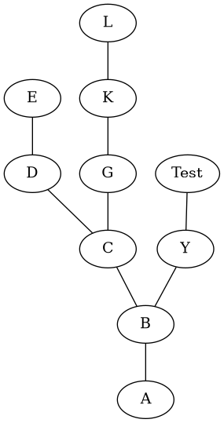
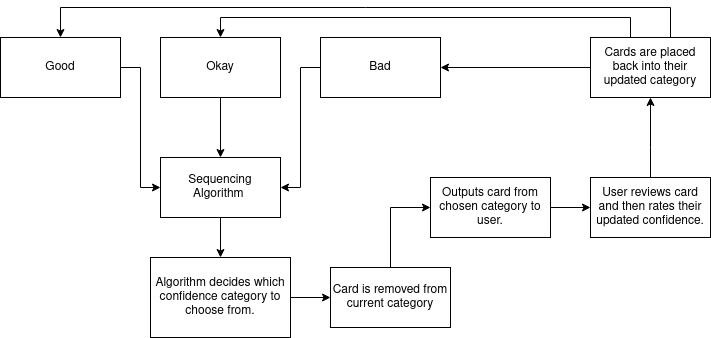

# Analysis
## Problem Identification
### Problem Description
As computational technology has progressed, it has been used increasingly in tasks that previously would have been done on paper. 
A classic example is the process of studying. Note taking is often classed as an essential part of this, and a number of note-taking applications have been created. 
When we look over pre-existing note taking application, we will see that they can be somewhat overwhelming, advocating for a high number of features rather than raw efficiency and usability. LambdaNotes will be designed to have a slim, clean GUI where information input is quick and easy, so that students can prioritise quanitity and not have the option to waste time making a 'pretty looking' workspace.

### Computational Suitability
This planned application lends itself to a computational solution since it is aimed at running on a computer system, removing the need for excessive amounts of paper and materials. LambdaNotes will focus on two main methods of revision.
Firstly,the computer program should be able to take in a prompt, and then continually ask for linked information, keeping track of which 'nodes' link to which, and be able to return this information in a variety of text-based and graphical ways. This can be thought of as creating a digital mind map.
Furthermore, the program will have a flashcard feature which will employ spaced repition techniques. This is very suitable for a computational solution since a computer can keep track of which flashcards should be shown to the user next more efficiently and effectively than a human could manually. 

Furthermore, the project will use the following computational methods:

- Pathfinding: To find paths between information nodes in mindmaps, I intend to use an algorithm, such as Djikstra's algorithm, to allow the user to find how snippets of information link to one another.
- Random Generation: To ensure that flashcard ordering upon retrieval has some element of randomness to it, a computational approach allows me to generate random numbers and implement the results in a way to create a suitable and effective flashcard weighting algorithm.
- Abstraction:
  - General Problem Abstraction: During the Design phase, I will implicitly use the ideas of abstraction to reduce the problem down to a more simple derivative, void of any unecessary complexity.
  - Using Object-Oriented Abstraction:
    - Data Abstraction: Objects that the software uses (e.g. GUI windows, Mindmaps etc) will hide its data, which will only be accessed through methods. 
    - Process Abstraction: When using OOP to create scripts that will be called from elsewhere, I need not worry about the inner implementation of each function/process I call. This abstracts out the sometimes complicated information on implementations, and reduces the problem of using the script elsewhere when necessary to simply knowing the parameters needed and the preconditions.
- Decomposition: I will use this method heavily in the Design section to break down the code to better understand the individual modules that will be needed to make the software full and functional.

## Potential End-Users and Stakeholders
The clientelle this application will be aimed at includes students, event planners and anyone looking to brainstorm. 

### Applications
#### Studying
This program will be optimal for this purpose. It will streamline a student's revision by making it easier for said student to link all the information they need to remember together. An article published by the University of Malta states 'we live in an information age which means that our problem is less one of obtaining and more of retaining and organizing all the information that we are required to ingest' and 'Mind maps offer a dynamic learning method to keep students attention, engage students in a fun, creative way, improve information retention, and recall abilities.' (Grech, 2016, pp. 108). Furthermore, an article in Nurse Education Today states 'The use of mind maps incorporated into an assessment strategy and programme is an innovative way of facilitating students to understand key information. Mind maps have the potential to provide students with a strategy for retaining information, integrating critical thinking and problem solving skills.' (Noonan, 2013).


All of this points to the advantages of using a mind-map note taking system in this context. This will be the main focus that the program is tailored towards, however it will not be incompatible with stakeholders from other areas of usability.

Flashcards are a common method of revising and have been for many years. However, many people do not use these effectively and so do not gain the full potential of the method. Spaced Repition has become increasingly recognised as one of the best way of revising. In an article from the *Policy Insights from the Behavioral and Brain Sciences* journal, it is said 'Hundreds of studies in cognitive and educational psychology have demostrated that spacing out repeated encounters with the material over time produces superior long-term learning. [...] Spaced review or practice enhances diverse forms of learning, including memory, problem solving, and generalization to new situations. Spaced practice [...] has tremendous potential to improve educational outcomes.' (Kang, 2016, pp. 12). 

If the program can effectively use a scheduling system to apply spaced repitition in a flashcard-oriented manner, it will be incredibly beneficial to studying applications.

#### Business Applications
In an article from the *Journal of Contemporary Management Research* states 'Mind Maps can actually facilitate the 
core business skills – such as choosing from among alternatives, organizing one's own and also other's ideas, analyzing, defining and 
solving problems, using hindsight and foresight, restructuring business(es), negotiations, risk controlling, 
setting and meeting time and financial targets. 
A Mind Map can indeed be a time-saving and cost-saving tool. A Mind Map enables the presenter to capture key points and
organize the flow of the message.' (Buzan, 2011).
Hence one can observe that the program will have applications in this sector as well. Users will be able keep track of ideas, and have tools to be able to filter through these, as well as innotive ways to gain inspiration by observing links between items that they may have not realised had they not used a mind map layout.

It is true that the flashcard feature will not be as applicable in this area, however this is not a problem since LambdaNotes is tailored toward studying. Measures will also be taken to make sure this feature does not get in the way of business stakeholders.

### Introduction to the Stakeholders

Stakeholders will be presented as following:
- A short biography of the person.
- Their answers to a collection of set questions depending on which stakeholder group they fall into (student or other).
- Their answers to questions specifically designed to build on their answers from previous questions.
- An analysis of all the answers.

All stakeholders have been briefed on what LambdaNotes aims to achieve.

#### Rupert (Full-time Student)

Rupert attends a non-selective state school. He is known as a struggling student. It is believed he is struggling due to work ethic rather than any kind of learning disability.

###### Interview - Predefined Questions


- Q: Would you class yourself as a enthusiastic student?

  A: No, I find myself not enjoying school most of the time. I always look forward to the weeekend. 

- Q: How much time would you say you study for a week outside of school (not including homework)?

  A: Probably less than an hour. 

- Q: When you do partake in revision, what techniques do you use currently?

  A: I usually just read my textbooks. It takes the least effort!

- Q: What experience do you have using mindmaps? Do you like them?

  A: Not a lot, I've done them in class before when the teacher has set it as a task. I think they are better than normal notes. 

- Q: Would you be more likely to make notes on paper or digitally?
 
  A: Digitally, I think. Keeping loads of paper about is annoying. I also prefer typing than writing with a pen et cetera. 

- Q: What experience do you have with digital notetaking apps?

  A: None. I've made notes on Word once before for homework, but I haven't used any apps specifically made for the purpose.

- Q: What would you look for in a digital notetaking application?

  A: Something quick. I want to able to get a lot of revision done in a short time so I can get on with other things.


###### Interview - Personalised Questions


- Q: You said you think mind maps are better than normal notes. Why is that? 

  A: I like how they can develop quickly, and you don't have to copy out loads of information to make them useful. 

- Q: Do you think if you found a 'low-effort' way of revising, you would try to use it consistently?

  A: Yes. It would be good because I can say I've done revision without spending hours copying out a textbook.

- Q: Finally, you said you had used Word for notetaking, how was that experience?

  A: Very boring. It's no different to just copying notes down on paper really.


###### Interview Analysis


- Personality: Rupert does not have much motivation when it comes to revising, often choosing to not spend effort on it. Hence, his 
  academic results are not at their full potential. This means one can test the effectivness of LambdaNotes by seeing how it can 
  improve his time spent revising and hence his school results.

- Experience: This stakeholder does not have much experience in the area LambdaNotes fits into. This will allow for user feedback from
  a perspective that is not solely comparing the software to other alternatives. 

- Desired Features:
  * Easy to revise a lot in a short period.
  * Adds to your motivation.


#### Alex (Full-time Student)

Alex is known to be a hard working student who strives for the top grades. He has aspirations to be a Doctor of Medicine and to study for this at Oxford University. 

###### Interview - Predefined Questions

- Q: Would you class yourself as a enthusiastic student?

  A: I enjoy school a lot and my friends make the experience much better. Sometimes the weekends are quite boring. 

- Q: How much time would you say you study for a week outside of school (not including homework)?

  A: About 14 hours. 

- Q: When you do partake in revision, what techniques do you use currently?

  A: I like to read and transcribe notes onto a document and then complete past questions. 

- Q: What experience do you have using mindmaps? Do you like them?

  A: I don't usually use mind maps, but I do think they are effective in connecting relevant information.

- Q: Would you be more likely to make notes on paper or digitally?
 
  A: Probably on paper first, then copy them digitally as a reinforcement technique.

- Q: What experience do you have with digital notetaking apps?

  A: I am quite familiar, since I like to digitalise my notes.

- Q: What would you look for in a digital notetaking application?

  A: I would like to see a feature that has a 'recommended' section that suggests pages that haven't been visited in a while.


###### Interview - Personalised Questions


###### Interview Analysis


#### Gretchen (Wedding Planner)

Gretchen is a self-employed wedding planner, having been in the buisness for 22 years. She, at anyone time, can be planning up to 20 ceremonies. 

###### Interview - Predefined Questions


- Q: How do you go about planning a wedding?
 
  A: Firstly, we need to find what each party wants. Sometimes, they don't have the same ideas and don't know how to get a good middle ground. Once that is done, we build upon the basis that has been settled on and branch out from there; venue, food, entertainment et cetera. 

- Q: What tools do you use? 

  A: The majority of the time I use a folder for each client. This makes it easier to move between projects without getting confused. 

- Q: Would you consider using a digital notetaking solution?

  A: Although I am happy with the system I have developed over the last 20 years, I would consider using a novel piece of software to work in conjunction with what I already do. There's definitely space for an extra supplementary tool. 

###### Interview - Personalised Questions


- Q: You said that sometimes there are discrepanicies between what the partners want. How could a system based on links between items be of use to you in this context?

  A: I think that it would be useful for finding a middle ground quicker. For example, if we kept building links between ideas then it would be possible to pick any two thought and find the easiest way they link together. From your description of what your program will do, if we could find multiple methods to link ideas I think it will be better for the wedding since it will be more evenly split based on the wants of each partner.

- Q: If you do find yourself finding LambdaNotes as a useful tool, will you keep it to yourself or recommend it to customers for personal use. 

  A: Well you have said it will be free, I think I would recommend it to my clients. What have they got to lose? If the outcomes can be viewed on both of our systems it will streamline the process significantly. 


###### Interview Analysis


- Personality: Gretchen shows a professional outlook which will be incredibly useful when it comes to user feeback as we develop the 
software. She is eager to test out new methods, and so hopefully will test LambdaNotes throughly and with genuine interest.

- Experience: She has a lot of experience using notetaking for her buisness; this will help gain feeback from someone who can compare it to other notetaking tools. Her years of experience in her industry will also help to see how LambdaNotes can fit into existing workflows and how it could revolutionise peoples way of working.

- Desired Features: 
  
  * Find routes between two nodes. 
  * Suitable for a professional enviroment.
  * Be able to be used in conjunction with pre-existing solutions.

## Comparable Solutions

In this section, we will look at pre-existing software. This will help to decide which features to borrow, and which to actively not 
include so as to make LambdaNotes something fresh on the market.


The analyses of these will be formatted as following:
- An introduction to the program
- Stakeholders current opinion on the software (if applicable)
- List of features
- Further analysis of selected features
- What can be taken as inspiration from this software
- Conclusion

### Notion

### Obsidian

### Anki


## Planned Solution

The following is the planned soltuion for a full LambdaNotes release. As will be discussed in due course, not every feature will reside in the scope of the implementation of this project, however it will still be used accordingly in the *Design* section.

### Visual 
###### UI:


The program will boot into a window featuring a simple to understand UI. This menu will have options to create a flashcard deck, or open a prexisting one and options to open a current mind map or make a new one.


###### Mind Map:


Upon a point of the user's choice, an output will be available to see the representation of how the data is being stored. This will be either a JPEG, PNG, PDF or SVG based on the users choice of configuration. 


###### Added Information:  


The user will be able to choose a node and put additional information 'underneath' it. This can then be retrieved when needed.


###### Revision Suggestions:


The program will be able to suggest nodes to the user that they may have not visited/inspected recently.


### Computational


###### Pathfinding:


The user will have the option to find links between two nodes anywhere on the mind map. If chosen, multiple pathways will be outputted.
This is so that the idea of how information is linked (which has been seen to be advantegeous for my stakeholders) in multiple ways. 
In a context of studying, this will help build links between knowledge and hence help retainment.


###### Date Storage / Databases:


The data created by a creation of a Mind Map or a flashcard set will be stored in some way for later retrieval. Furthermore, it would be optimal to have a website where users can upload their Mind Maps and Sets for other's use. Said website
could also be used as the landing page to download the software.


###### Installer:


The program will be downloaded through an installer that will render the program as an executable, and make sure the required packages are also installed to the end users machine.


### Limitations

One limitation of my solution is that the mind map output (at least in its first iterations) will not be that customisable 
or interactive. It will just be an output to see visually. Another limitation is that there won't be an option for added 
information that can be stored to be represented on the mindmap; although it is an advantage that the Mind Map will be easy to read,
it is probable that in some people's perspective this will be a lacking feature.

The limitations of the flashcard software is that it won't have sub-cardsets within the scope of this program, however it may be able to in future iterations.

## Program Requirements

The following table contains the program requirements. This is a list of features that would be needed to call any certain version a 'fully fledged' piece of software. Therefore, not all features listed may be fully implemented within the scope of the project.

It uses a numbering system in the form (section number, requirement number). e.g. (1.1 refers to Requirement 1 from Section 1). Any requirements listed in parentheses, (), are possible requirements that could be implemented at a stage after the program was in a state where it would be able to be fully released; it would pose the possibility to improve the software, but is not essential to its full use.

- **Section 1** - Application Access and User Interface
- **Section 2** - Mind Map Functions and Algorithms 
- **Section 3** - Flashcard Functions and Algorithms
- **Section 4** - Data Collection and Storage
- **Section 5** - Usability and System Requirements

| **Numerical Identifier** | **Description** | 
| :---: | ------------------ |
| 1.1 | Installer for software  |
| | |
| 1.2 | Desktop widget/access for program opening |
| | |
| 1.3 | User can choose whether they want to enter mind map, flashcard, data access or configuration mode |
| | |
| 1.4 | Incorporates colour and some above-minmal design |
| | |
| 1.5 | Fast changes between pages of the software/UI |
| | |
| 1.6 | Data safe exit of application (e.g. Notifying user they have unsaved chages). **Note**: Depending on the implementation of how data is stored, an active check may not be necessary |
| | |
| 1.7 | Configuration of program should allow user to specify which modules they want active/accessible (mind maps, flashcards or both)
| | |
| 1.8 | Configuration of program should be handeled using a user-editible configuration file |
| | |
| 2.1 | Able to export visual representation of mind map into a visual picture format |
| | |
| 2.2 | Able to view mind map in application |
| | |
| 2.3 | Able to view mind map outside of application through native file system |
| | |
| 2.4 | Able to show fastest link between two given nodes |
| | |
| 2.5 | Able to show multiple pathways between two given nodes |
| | |
| 2.6 | Can list all nodes in a given mindmap |
| | |
| (2.7) | Can show possible links between two given mind maps |
| | |
| (2.8) | Can merge two mind maps and store this data structure |
| | |
| 3.1 | Able to create a deck - aka a place in storage where flashcards will be stored |
| | |
| 3.2 | Able to add as many flashcards as needed into a deck |
| | |
| 3.3 | Able to store the following information about each card: Front (e.g. prompt/question), Back (e.g. answer), Confidence (Very Good, Good, Okay, Bad, Very Bad), TimesVisited |
| | |
| 3.4 | Able to quiz the user on the decks they have made |
| | | 
| 3.5 | User can change confidence level of the card they have just been quized on according to there confidence on that attempt |
| | |
| 3.6 | Have a suitable algorithm that inspects the cards rated at each confidence level and presents the user the cards in a manner which cards with lower confidence are seen more than ones with high confidence |


| **Numerical Identifier** | **Description** |
| :---: | ------------------ |                
| 4.1 | Reliable way of storing data long term |
| | |
| 4.2 | The format in which data is saved should be such that it can be transferred to another system and interpreted by another instance of the software |
| | |
| 4.3 | Updates to the software should be independent of the data collection and storage system so as to ensure updates do not invalidate previously created and stored data. Hence, the data collection and storage program should be designed and implemented in a way in which it will not need to be updated after initial development |
| | | 
| (4.4) | Online database of data that can be uploaded by users for other users |
| | |
| 5.1 | Easy to use software: simple UI and intuitive controls |
| | |
| 5.2 | Easy to run on any computer system, so long as its native software can support the needed dependencies for the program | 


## Stakeholder Feeback

We asked all the stakeholders their thoughts about the proposed features of the software:

### Rupert

Rupert reported he was happy, so far as he could see, with the planned software. It must be noted, however, that his lack of 
previous experience with such programs does not put him in the best position to comment. 

He did suggest we make the requirement that the UI incorporated colour, and hence more interesting to look at and catch the users 
attention. This can now be seen under criterion 1.4 .  

### Alex

### Gretchen

Gretchen was very keen to praise the intended mind map section of the criteria (*Section 2*) and said "This looks like the program 
could be very promising for applications in my buisness". 

However, she did note that the inclusion of the flashcard features would not be of use and could become annoying if they were to 
prominent. Because of this, it was decided that the configuration file should have a parameter to disable the flashcard features. Additionally, this functionality will extend to being able to choose to only have the flashcard feature over the mindmap feature. This addition can be seen in criterion 1.7 .

## Project Success Criteria

Since the program requirements lay out a vast selection of functionality that would be packaged into a final iteration of LambdaNotes, it is important to create a set of criteria upon which the success of this project, in its own scope, can be measured against.  

The general aim for this project is not to create a finalised piece of software, but instead put important foundations in place so that, by the end of the project, the code could be added upon to create all the functions one would need in a full release of LambdaNotes.  

The following table lists these measures of success, and will reappear upon completion of the project implementation in the *Evaluation* section:

| Success Criteria Code | Description |
| 1 | Have a functioning system to run SQL transactions to add and remove flashcards |
| 2 | Have a functional GUI to navigate the existing modules |
| 2.1 | Have a robust, object oriented approach to window creation and switching |
| 2.2 | Have a clearly tested way to add extra windows into the pre-existing UI when required |
| 3 | Have a functioning mind map creation window |
| 3.1 | Have a visual output feature for when the mind map has been created |
| 4 | Have an intuitive full build prototype |
| 5 | Gain positive feedback from stakeholders at the end of the initial implementation |

## Pre-Design Phase Prototyping

Before beginning a full design phase of the project, I have decided to create a couple of programs that act as a proof of concept. These include an initial algorithm for constructing a mind map and an algorithm to start to test out flashcard suggestions.

### Mind Map Algorithm

```python
import pydot as pd #imports package needed for mindmap output
                                                                                                 ```
graph = pd.Dot(graph_type="graph", rankdir="UD") #creates instance of graph, edges and nodes will be added 'into' this.

#Class Node is the class that will be a blueprint for every 'node' of data on the mind map. 
class Node: 
  def __init__(self, name):
    self._name = name 
    self.connections = [] #this is where the connected nodes to each instance will be stored.

  def name(self): #makes it easier to access the name of each object.
    return self._name 

  def connector(self, previousNode): 
    self.connections.append(previousNode) #adds the previous node (hence the node the instance which is using this function was connected onto) to the connections list
    print(self.connections) #simply for keeping track whilst prototyping.

#Class MindMap is a class that will handle the initialisation of a new mindmap and contructs it once all the nodes have been added. Not much use for now since we are only creating one mindmap at a time during prototyping but will be helpful when it moves to full development.
class MindMap:
  def __init__(self, nodes, names):
    self._nodes = nodes
    self._names = names

  def edges(self):
    for i in range(0, len(self._names)): #iterates through the length of the list of node names
      parent = self._nodes[self._names[i]].name() #sets the parent of the connection to the node with the name at the index i. Hence all nodes will be iterated over this way.
      for j in range(0, len(self._nodes[self._names[i]].connections)): #iterates over the list of connections to the parent node
        edge = pd.Edge(parent, self._nodes[self._names[i]].connections[j]) #creates edge between parent and current node (at index j in the nodes connection list)
        graph.add_edge(edge) #adds edge to graph


nodes = {}
names = [] # not very happy with using this structure, seems clunky but is a good soltuion for now.

count = 0
lastNode = 0
firstNode = True


while True:
    
  if lastNode != 0: 
    currentIndex = names.index(lastNode)
    
    nextInput = input("Enter: ")
    
    if "<" in nextInput: #function to be able to backtrack, (need to fix, e.g. "jk<l" would cause error)
      if nextInput[1:] in nodes:
        lastNode = nextInput[1:] #takes input after the '<' as the node the user wants to backtrack to.
      else:
        print("Error - Node not already made. ") 
      #lastNode = names[currentIndex - len(nextInput)] (was initally used to back track a set number of hops rather than to a inputted node.
      elif nextInput == "exit": #function to complete node addition
        break
        
      else: #if input is not a special case, node addition can go ahead:
    
        if nextInput not in nodes:
         nodes[nextInput] = Node(nextInput)
         names.append(nextInput)
    
        if firstNode != True: #needed since first node cannot connect to nothing!
          nodes[nextInput].connector(lastNode)
          lastNode = nodes[nextInput].name()
        else: #hence if it is first node then it has no connections.
          firstNode = False
          lastNode = nextInput
    
    
#print(nodes) (prototyping feature)
    
#print(nodes['a'].connections)  (prototyping feature)
    
map1 = MindMap(nodes, names) #creates instance of a mind map.
map1.edges() #calls to create mindmap
    
graph.write_png("/tmp/test.png") #saves it in file (in /tmp/ for prototyping since saves in RAM)

```

### Mind Map Output

The following output is what is saved when the above code runs using the following input: A, B, C, D, E, <C, G, K, L, <R, Y, Test, exit .





The following output is what is saved then the above code runs using the following input: Physics A-Level, Quatnum Phenomena, Photoelectric effect, <Physics A-Level, Particles, Bosons, <Particles, Fermions, Hadrons, <Fermions, Mesons, exit . 


### Flashcard Algorithm

Since the actual sequencing algorithm for this function will take considerable design and implementation of a database, the prototype will be in the form of a brief plan, and some minimal code implementation.

Below, you can see said plan:



This appears to be a simple loop, and indeed that is how will appear to the user when being used. However, the actual content of the shceduling algorithm has the potential to become complicated to implement so that its output is optimal for learning. The method by which it is designed will, of course, be discussed in the *Design* section.

The following code is a highly simplified proof of concept. It arose from simply thinking how the 'significance' of the flashcards could be changed based on the users changing confidence. The real implementation will use a database and a more nuanced method of determining how the significance should be changed.

```python
import random

flashcards = []

class Flashcard:

    def __init__(self, confidence):
        self.confidence = confidence
        self.significance = 10 # Current starting significance, will be updated depending on how testing goes.

    def update(self):
        self.confidence = input('Confidence: ')
        if self.confidence == 'good':
            self.significance -= (3 + round(random.uniform(-0.9,2.1), 3)) # Random element to it so that the flashcards do not all have the same significance.
        if self.confidence == 'bad':
            self.significance += (3 + round(random.uniform(0.9, 3.1), 3))
  
  # The following lines are here to reproduce a readable indicator of which instance of the class we are looking at whilst prototyping.
    def __repr__(self):
        return f"{self.significance}"

    def __str__(self):
        return f"{self.significance}"


def sort(data): #Bubble sort method, will aim to update to quicker sort incase of larger flashcards decks. Sorted on significance.
    for i in range(0, len(data) -2):
        for j in range(0, len(data) - i - 1):
            if data[j].significance > data[j+1].significance:
                data[j], data[j+1] = data[j+1], data[j] #Swap function

    print(data)
    


for i in range(0, 10): # Prototyping function to create flashcards, no additional data other than confidence added so as to make prototyping more efficient.
    confidence = input('input: ')
    flashcards.append(Flashcard(confidence))

for j in range(0, len(flashcards)):
    #print(flashcards[j].confidence) 
    flashcards[j].update() 
    print(flashcards[j].significance) 
sort(flashcards) 
```

