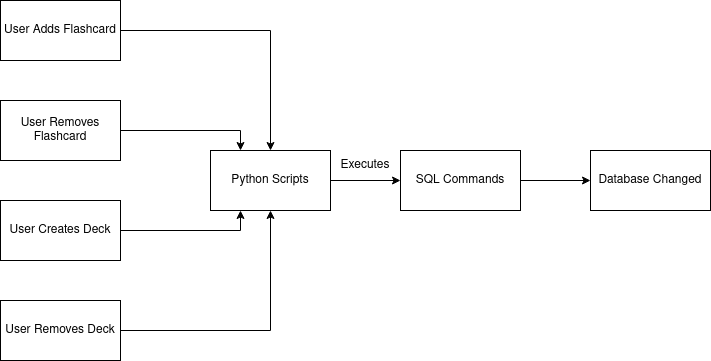

# Design
## Design Sequence
The design phase of LambaNotes will be split into two main sections: designing the algorithms and backend structures, and mapping out how this will be packaged into a user interface. 

Whilst the *Analysis* section has provided a strong basis for what the program will achieve, I believe it will be advantageous to carry out the design of the two phases in the order they are given above. This is because it it possible that the design of the components will create new ideas on how to present them in a GUI. 

Furthermore, I will follow an agile development life-cycle and so work simultaneously on *Design* and *Implementation*. How I go about working on these together will be clearly stated and split over the two chapters. Whilst working on the design, if I believe it could be improve by returning to the *Analysis* stage I will do so, however any analysis added will be clearly noted with a suitable disclaimer.

## Overview
Before the design of each specific module of the program is mapped out, I believe it to be advantageous to design and analyse a zoomed-out plan for the project. This can be used to keep track of the main features of the program, and also to inform what how designs of each part of this diagram must account for communication with another (according to the arrow directions between them). 

Please see the following design:

 

These features have already been discussed however this diagram provides a clear set of possible user stories, and how each sub-feature links to others to create the overall program. 

It was a clear decision to start the flow of the program from a home screen. The user can then decide which route to go down, mind map or flashcard. ([^1]) From here, they can decide whether to make a new instance of the tool they have chosen, or to inspect/edit an instance they have already edited previously. ([^1]:Please note that, although the arrows do not directly imply it in the diagram, that a user will be able to move back to the home screen to be able to change which tool they are using.)

## Config File
So as to add customisability to the user expeirience, the software will have optional modules and ways of operating, these will be defined in a configuration file that will be editible by the user. This refers to sections 1.7-1.8 of the success criteria.

The file will take the form of a .txt file, with predefined places to put your options. I will slowly build up the fields in the file as they become needed, and the implementation they will affect gets to a point where a need for optional routes is clear.

The following shows the final state of the configuration file:

```
LamdaNotes
[version] = 0.0.1
[mindmap-active]= true
[flashcard-active] = true
[flashcard-queue] = true

``` 

## Flashcards

I have decided to design this feature first since it went through less proof-of-concept prototyping in the *Analysis* phase. It is also poses a unique challenge compared to the rest of the project since it requires the combination of two programming languages (Python and SQL). 

### Overview

In this section (and elsewhere moving forward) I will refer to 'cards' and 'sets'. A 'set' is the group of flashcards, presumably holding a common topic, for example a user could create a Physics A-Level set of flashcards. 'cards' are simple a contracted way to reference flashcards.

### Flashcard Format 

The flashcards will have the following attributes:

- Front: This will include the prompt.
- Back: This will hold the answer to the prompt on the front.
- Significance: This is the attribute that will be utilised in the sorting algorithm to help decide how to order the output of flashcards.

The following shows an example set of attributes a flashcard could have:


The significance value is placed to the side because it will not be known to the user and only be used for the backend processes. The user will, however, influence the significance through a GUI input that represents their confidence in the content of the card. These will not be attributes, since all the information about the relevance to the users learning will be stored in the significance attribute.
### Database Design

The program must be able to handle multiple sets of flashcards, with each set containing an arbritrary number of cards. 
For simplicity, if a flashcard is entered in identical form into multiple sets multiple records of the flashcard will be stored, each with a unique foreign key. There will, however, be an implementation of code to check whether there is already a record of a flashcard's Front when it is being inputted. 

The following ERD (Entity Relationship Diagram) displays how two tables will be linked through use of a foreign key so as to create the required construct for storing the flashcard information.


This design conforms to the Third Normal Form, and does not pose any problems with the relationship between the tables (e.g. not many-to-many). This provides a good basis moving forward, and will be advantageous if additions should need to be made after prototyping.


It is also important the relational database will conform to ACID rules:
- Atomicity: This will be enforced by checking the statement has been executed and, if not, diverting the flow of the program to a suitable location where the database will not be permanently affected.
- Consistency: The addition of declaritive constraints will ensure each addition conforms to the database rules.
- Isolation: Since the program will only be making transactions in a sequential manner, and the database will be stored locally with no possible outside access from other systems, Isolation will not be an issue and will be conformed to.
- Durability: To ensure that all data entered from succesful transactions is permanently stored, the database will be consistently saved at regular intervals, reducing the chance of interference from, say, a system failure.

### Utilising Python To Execute SQL

To create more complex conditional transactions, and to integrate the database into the program, I will use Python to control the databse through using it to execute SQL. 

The following diagram shows the flow of the program from user input to permanent database change:



The four choices the user can make will be implemented in separate python classes which will form a library that can be imported into other files in the program structure. This is not implemented this way so as to use an object oriented methodology at this time, it is due to the ease of accessing specific functions from the library in external programs; using a class system improves naming conventions, e.g. AddFlashcard.create() can be different to AddDeck.create(). The classes will be:
- General (this will handle subroutines that can often be used in more than one of the four areas in the diagram above.)
- AddFlashcard (this will handle subroutines specific to adding flashcards.)
- RmFlashcard (this will handle subroutines specific to removing flashcards.)
- AddDeck (this will handle subroutines specific to adding a deck.)
- RmDeck (this will handle subroutines specific to removing a deck.)

The class diagram will be created once all the functions for each of the 4 main functions have been mapped out in the following sections.


I will make use of SQlite3. This can be imported and used within Python, and also in console which will help with testing the Python script works as expected.

##### Functions:

From the previous diagram, I will now decompose and design the functions in a more intricate manner. This will take the form of a visual decomposition of each of the 4 overall functions in 2.3.4, followed by a list of subroutines described in detail to work together to create the overarching function required. 

### User Adds Flashcard:

The following diagram shows what this problem can be decomposed down to at a still moderately 'zoomed-out' view:


The design incorporates two methods of flow through the program, based on a configuration file. This relates to 1.8 of the *Success Criteria*. Furthermore, the design also addresses 3.2 and 3.3 of the same criteria. The reason for having these two options is that if the user wants to minimise the chance of losing information, insantly adding any new flashcard to the persisten database is optimal. If, however, the user would prefer to be able to review the flashcards (e.g. remove or edit) before they are commited to the database, using a in-memory data structure would be suitable. The user can decide what is more important to them. For many users the program will seemingly run exactly the same, however for more involved users this flexibility aims to be a satisfying addition.

I will now list out the functions that will be needed when implementing this script.

#### CardPointer

##### Use: 
To keep track of what the next free cardID is, by searching the Database at the start, and then keeping track through a variable.

##### Parameters: 
None

##### Variables:
- *int* cardID (next free cardID)

##### Returns: 
Returns *cardID*

##### Preconditions: 
Database has been created with the Cardset and Flashcards tables.

##### Class:
General


#### GetInput

##### Use: 
The subroutine will take a user input in. Validation will be used to check inputs are not null.

##### Parameters: 
None

##### Variables: 
- *string* input (the input the user puts in)

##### Returns: 
Returns the input in a list-based format.

##### Preconditions: 
There are no preconditions to the use of GetInput, since validation is used.

##### Class:
AddFlashcard


#### FormatInputSQL

##### Use: 
The subroutine will take an input as a parameter, and put it into a correct format to be passed into an SQL statement. 

##### Parameters: 
- contents (a list of elements that must be put into the SQL statement.

##### Variables: 
- *string* statement (the formatted SQL statement)

##### Returns: 
Returns the formatted SQL / returns variable *statement*. 

##### Preconditions: 
Data passed through *contents* parameter is in the format : (UPDATE AFTER IMPLEMENTATION!!!!)

##### Class:
AddFlashcard


#### ConfigCheck

##### Use:
To check the config file and alter the flow of the program according to the user's chosen method.

##### Parameters:
- ConfigFile.txt

##### Variables:
- *bool* queueFlowType (the chosen method to move through the program)

##### Returns:
- *queueFlowType*

##### Preconditions:
- ConfigFile.txt exits
- ConfigFile.txt is in the required format / is not null.

##### Class:
AddFlashcard


#### NewQueue

##### Use:
The subroutine will create a queue to add flashcard information to until the user is ready to exit, if this option is chosen through the config file. 

##### Parameters: 
None

##### Variables:
ADD AFTER IMPLEMENTATION

##### Data Structure:
Queue

##### Returns:
No return, Queue will be in the wider scope and so can be accessed from the other subroutines.

##### Preconditions:
None

##### Class:
General


#### EnQueue

##### Use:
The subroutine will add a set of flashcard information into the queue, in the same form as *GetInput()* returns said information.

##### Parameters:
- return data from *GetInput()*

##### Variables:
ADD AFTER IMPLEMENTATION

##### Data Structure:
Queue

##### Returns:
No return.

##### Precondtions:
- *NewQueue()* has been executed/there is a queue to add to. 

##### Class:
General


#### cursor.execute (from SQLite3 library)

##### Use:
To execute the SQL statement within it on the persistent database stored in a stated directory.

##### Parameters: 
*statement* variable (SQL statement)

##### Variables:
N/A

##### Returns:
No return in the usual sense; changes the SQL database.

##### Preconditions:
- Parameter is not null.
- SQL statement is valid by the SQLite3 rules.


### User Adds Flashcard Testing

This function of the program should have a predictable, reproducible output. It is clearly defined what must happen, and we can see if this is working through the use of the terminal SQLite3 interface. I will carry out the following tests during devlopement:

##### During Writing Code: 
- (1) Consistently test each subroutine in an isolated environment.
- (2) Consistently make sure the flow of each subroutine into another works as exected (any two subroutines in isolation).
- (3) Test how the program handles errors, e.g. a precondition of a subroutine being ignored. 

##### After All Subroutines Are Written:
- (4) Make sure this singular function of the program is logically working as expected when subroutines are combined.
Note: This will isolate the function *User Adds Flashcards*, and not test it incorporated in the wider program (this will come later).
