# Implementation 

## Flashcard System

### Database 

#### Raw SQL Prototype

Note: I have named prototype 'Raw SQL' since it is written and tested in pure SQL form, rather than linked into Python like the final product is planned to be. 


In section 2.3.3., there was an ERD presented. To make sure this system works, I will implement this into SQL and trial some basic transactions. Further testing of the final product will be carried out once the functionality from Python is implemented. 

The following is the SQL definitions of the tables. The SQL seen here was written in Repl.it's SQLite environment.

```sql
CREATE TABLE Cardset(
   setID int primary key NOT NULL,
   setName varchar NOT NULL
);

CREATE TABLE Flashcards(
   cardID int primary key NOT NULL,
   front varchar NOT NULL,
   back varchar NOT NULL,
   significance float NOT NULL,
   setID int NOT NULL,
2023-01-23_17-38   CONSTRAINT FK_setID foreign key (setID)
   REFERENCES Cardset(setID)
);
```

First, I added a cardset:

```sql
INSERT INTO Cardset
(setID, setName) VALUES (01, "Biology");
```

Using the setID of this cardset, I added a flashcard into said set:

```sql
INSERT INTO Flashcards
(cardID, front, back, significance, setID) VALUES (01, "What is the job of the ribosome?", "Proteinsynthesis", 10, 01);
```

To test whether the use of a foreign key is working in this relational database, I implemented a transaction using a table join:

```sql
SELECT Flashcards.front, Flashcards.back, Cardset.setName
FROM Flashcards INNER JOIN Cardset
ON Cardset.setID = Flashcards.setID;
```

Carrying this out resulted in the following output:

```
What is the job of the ribosome?|Proteinsynthesis|Biology
```

This is the desired output and shows that the planned structure of the database is viable.

In the *Design* section, it was said there would be a function of the program to check for duplicate fronts. I intend to fully implement this at a later point, however I did implement the following: 

```sql
INSERT OR IGNORE INTO Flashcards
(cardID, front, back, significance, setID) VALUES (01, "What is the job of the ribosome?", "Proteinsynthesis", 10, 01);
```

The change here is the addition of the OR IGNORE. This means a exact duplication of an earlier entry will be discarded. This also helps handle the potential for an error arising from a non-unique primary key. To make sure this was working, I carried out the following:

```sql
INSERT OR IGNORE INTO Flashcards
(cardID, front, back, significance, setID) VALUES (01, "What is the job of the ribosome?", "Proteinsynthesis", 10, 01);

INSERT OR IGNORE INTO Flashcards
(cardID, front, back, significance, setID) VALUES (01, "What is the job of the ribosome?", "Proteinsynthesis", 10, 01);

SELECT * FROM Flashcards;
```

This resulted in the output I wanted for now:
```
01|What is the job of the ribosome?|Proteinsynthesis|10.0|01
```

This method, however, is not perfect. This is because I plan to increment the cardID by one for each card added, and so by this method there wont be any discarding of duplicates, even when the content of the flashcards are identical. For example:

```sql
INSERT OR IGNORE INTO Flashcards
(cardID, front, back, significance, setID) VALUES (01, 'a', 'b', 10, 01);

INSERT OR IGNORE INTO Flashcards
(cardID, front, back, significance, setID) VALUES (02, 'a', 'b', 10, 01);

SELECT * FROM Flashcards;
```

Results in: 
```
01|a|b|10.0|01
02|a|b|10.0|01
```
Which is not what I want in the final implementation. I will keep the OR IGNORE feature for now since it does prevent a possible error.

#### Setting Up SQLite3 in Python

At this stage I have already downloaded SQLite3 using my native linux package manager. This section is to confirm the package is working correctly, and can be used to create and retrieve from databases as required by the program.

Since I have not used this format previously, I am using the documentation at: 
```
htttps://docs.python.org/3/library/sqlite3.html. 
```
For ease, I will follow their tutorial page to some extent to use as a simple program to check everything is wokring as expected.

Picking relevant parts of the tutorial from the documentation led to me having the following code. Note that I have changed some of their code to display, in my opinion, more robust SQL both in syntax and in formatting.

```python
import sqlite3 as sql #imports package into Python under more efficient name

con = sql.connect("test.db") #creates a connection to the database test.db.
# test.db will be created in the current working directory if not already made.

cur = con.cursor() #creates a database cursor which is needed to execute statements and retrieve data.

#to create table:
cur.execute("""CREATE TABLE movie(
            title varchar primary key,
            year int,
            score float
            )""") #uses the cursor to execute the SQL on the database currently connected.

#to add a record into the table:
cur.execute("INSERT INTO movie(title, year, score) VALUES ('test', 2022, 10.0)")

con.commit() #commits the transactions
```

This was stored under file name 'test.py'. 

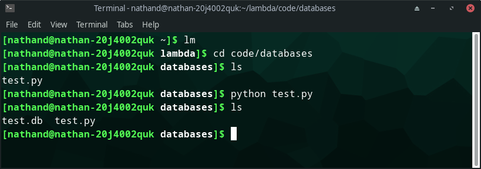

Above you can see that initially *test.py* is the only file in lambda/code/databases which is the directory I am working in. I then execute the code, and use ls (the linux command to show the contents of a directory) again to show that test.db has been created. This means the package is working and has successfully connected to a database. 

To check the other transactions have successfully completed I will use the console based SQLite interface:


I enter sqlite3 into the console to open the interface, use .open test.db to open the database just created, and then can execute SQL in a standard fashion. The output to the SELECT statement confirms the table *movie* has been created as exepcted, and a record has been added in its correct form. 

I am now happy SQLite3 is working correctly in its Python implementation and can move on to implementing LambdaNote specific scripts.

### Setting up FlashcardFunctions Library

In the *Design* section, 5 classes were used to organise functions that would make up the FlashcardFunction external library. To start the implementation of this, I first created a new file called FlashcardFunction.py and added the class definitions. No constructor function is being used here since, at least at this stage, nothing of the sort is required. (Please remember that the class system is for organizational purposes in this library, the code does not require the idea of objects.)

```python
class General: #class for general function that may be used my any of the proceeding classes.

class AddFlashcards: #class specifically for functions for adding flashcards

class RmFlashcards: #class specifically for functions for removing flashcards

class AddDeck: #class specifically for functions for adding a deck

class RmDeck: #class specifically for functions for removing a deck
```


### User Adds Flashcards

In section 2.4.5, I laid out a clear design for the functions that would be needed to create the function of a user adding a flashcard to any specified database. I now will implement it and test it according to the specifications in 2.4.5. 

The code snippets included in the following sections will exclude many of the class definitions in *FlashcardFunctions* and only show the necessary code/changes that have been made. At the top of each code snippet, however, there will be a comment stating which file it is in, however this comment is **not** there in the actual code and is soely for documenting purposes in this report.

To test the code as I go along, I have made a python script called TestingEnvironment.py which I will use to test how subroutines are working and performing as I continue to implement.

#### ConfigCheck

I decided to implement this function first since it largely affects how the rest of the code runs in this section. For efficiency, *config.txt* only includes the fields up to and including *flashcard-queue*, since that is the only field being used in the development of this section. In the next sections *config.txt* will grow to accomodate what is needed in those sections. To test the config file could be read correctly, I wrote the following:

```python
#in FlashcardFunctions.py
class AddFlashcards: #class specifically for functions for adding flashcards.


    def ConfigCheck():
        file = open("config.txt", "r")
        print(file.read())
```
This code aims to simply open the configuration file and print its contents to the screen. To test this I would call the function like such:

```python
#in TestingEnvironment.py

import FlashcardFunctions as Ff #imports library I have written

Ff.AddFlashcards.ConfigCheck() #calls the ConfigCheck() function from AddFlashcard class
```

When I ran this, the output I expected was:

```
LambdaNotes
[version] = 0.0.1
[mindmap-active] = true
[flashcard-active] = true
[flashcard-queue] = true
```

However, this is the output I did get:

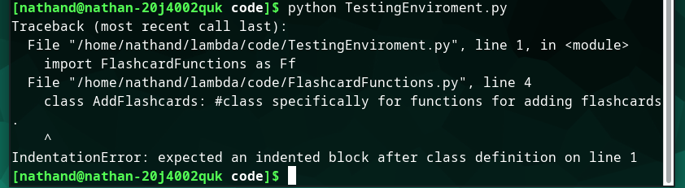

Clearly I need to add something to the empty classes. To do this I will add a *Null* function to each class for the duration of development, until they have their own functions implemented. Please see the revised code, and output after the changes have been made:

```python
#from FlashcardFunctions.py

class General: #class for general function that may be used my any of the proceeding classes.
    

    def Null():
        pass

class AddFlashcards: #class specifically for functions for adding flashcards.


    def ConfigCheck():
        file = open("config.txt", "r")
        print(file.read())

class RmFlashcards: #class specifically for functions for removing flashcards.
    

    def Null():
        pass

class AddDeck: #class specifically for functions for adding a deck.
    

    def Null():
        pass

class RmDeck: #class specifically for functions for removing a deck.
    

    def Null():
        pass
```
Output:

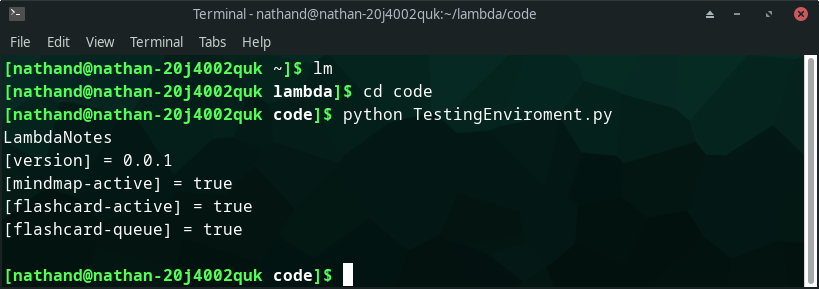

The code works as expected and so I will leave these additional function in until there is a chance to replace them. I am using them rather than a constructor because I beleive it reduces any chance of confusion.

Now, I will change the code to only read a specific line. Since the design of the congiuration file is such that each field has a designated line, I can hard code the line that must be read. Additionally, since it is a precondition that the configuration file is kept in the correct format, I can presume that the value of each field (e.g. true or false) always begins at the same index of the string that is read into the program.

The following code aims to single out the value of the [flashcard-queue] field, which is what is needed for the rest of the subroutine.

```python

    #from FlashcardFunctions.py

    def ConfigCheck():
        file = open("config.txt", "r")
        config = file.readlines()[4] #reads line 4, which is where flashcard-queue is defined to be.
        config = config[20:] #cuts out the unecessary information, to single out the only important piece of information (true or false)
        print(config)
```

When run, the code produced the following output:

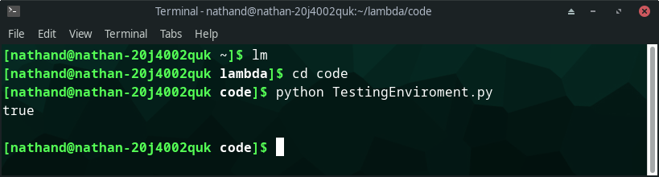

The code successfully isolates the value of the field important for this process. This value needs to be checked and placed into a variable that can be accessed by other subroutines in the class. I am future proofing the development by placing the value in a variable; I could just return the value read, or return a boolean value, however by putting it in a variable I still have the option of using object oriented variables at a later date if the planned solution of simply returning to other subroutines.

After another addition of code, the code looks as such:

```python

#from FlashcardFunctions.py

class AddFlashcards: #class specifically for functions for adding flashcards.


    def ConfigCheck():
        file = open("config.txt", "r")
        config = file.readlines()[4] #reads line 4, which is where flashcard-queue is defined to be.
        config = config[20:] #cuts out the unecessary information, to single out the only important piece of information (true or false)
        file.close()

        #the following selection statements compare the value isolated from the file and returns a suitable boolean value.
        if config == "true": 
            queueFlowType = True
        elif config == "false":
            queueFlowType = False
        else:
            print("ERROR: CONFIGURATION FILE - WRONG FORMAT")
            quit() #since correct config format is a precondition of the subroutine, no handling is done if the data read does not go to plan. The program simply puts an error message in the console and quits.


        return queueFlowType

``` 
The code in the test environment should now output True, since this is what will be returned by the subroutine with the configuration file in its current state. Using a slight change in TestingEnvironement.py to print out the result of the function [1.1], I run the code and get the following output:


This output suggests that the 'true' that should be being snipped from the config file is ,in fact, slightly wrong. I believe the problem is due to me forgetting the actual format will be 'true\n'. To fix this, I will define where the substring will end, rather than leaving it to finish at the end of the line, hence excluding the '\n'.

This is a simple fix:

```python
#from FlashcardFunctions.py

def ConfigCheck():
        file = open("config.txt", "r")
        config = file.readlines()[4] #reads line 4, which is where flashcard-queue is defined to be.
        config = config[20:-1] #cuts out the unecessary information, to single out the only important piece of information (true or false)
        file.close()
```

The [20:-1] ends the substring one before the end, which makes the code compatible with both 'true' and 'false' and with more specific values to the fields if ever needed in a future version of the program (beyond the scope of the project). 

Running *TestingEnvironment.py* again, the output is corrected:

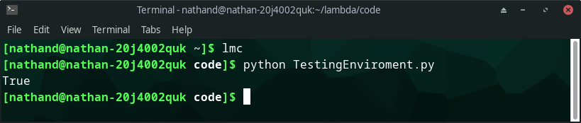

I also changed the value of [flashcard-queue] to 'false' in *config.txt* to test it would work as expected:


Finally, I put an invalid output into the field in the configuration file to test the output:

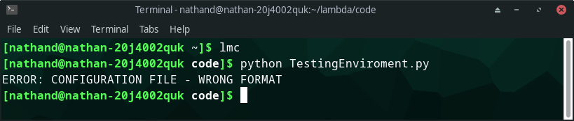

Everything is working as expected, however I want to restructure my code slightly to use the AddFlashcards class as an object. Initially I had not planned to do this, and the class system was purely for organisational purposes. However, now I am implementing it, using an OO paradigm is appearing to be the most stable way of implementing the software. This is because I do not have to rely on return statements, but use OO programming to use class attributes.

Implementing this paradigm shift leads to the following:

```python
#from FlashcardFunctions.py

class AddFlashcards: #class specifically for functions for adding flashcards.
    

    def __init__():
        self.queueFlowType = None

    def ConfigCheck():
        file = open("config.txt", "r")
        config = file.readlines()[4] #reads line 4, which is where flashcard-queue is defined to be.
        config = config[20:-1] #cuts out the unecessary information, to single out the only important piece of information (true or false)
        file.close()

        #the following selection statements compare the value isolated from the file and returns a suitable boolean value.
        if config == "true": 
            self.queueFlowType = True
        elif config == "false":
            self.queueFlowType = False
        else:
            print("ERROR: CONFIGURATION FILE - WRONG FORMAT")
            quit() #since correct config format is a precondition of the subroutine, no handling is done if the data read does not go to plan. The program simply puts an error message in the console and quits.


        return self.queueFlowType #returns variable in classical way; may not be needed but I believe it is good to have the option to use it this way.
```

This produces the same outputs as before when using a slightly modified version of the previous iteration of TestingEnvironment.py since it is still implemented to return the variable as before, just with the inclusion of Python's 'self' constructs. The testing environment now creates a new AddFlashcard object and then calls the CheckConfig function. (See [1.2])

For now, I am happy that CheckConfig() works as intended and will continue to work when used by other subroutines.


#### GetInput

The *GetInput* function will look vastly different by the time of finishing the development since packaging it into a GUI will change how it takes the input (won't be through console anymore). At this stage, which is creating a console prototype and a set of functions that can be tweaked at the GUI stage, this function is very simple to implement.

The preliminary version ended up like so:
```python
#from FlashcardFunctions.py, in AddFlashcard class

    def GetInput(self): #will need to be updated when packaged into a GUI.
        valid = True #used to check input is valid
        front = input("Please input front: ")
        back = input("Please input back: ")
        conf = input("Please input initial confidence: ")
        
        if not front: #the following statements check the inputs are not null, and if they are, change the valid variable accordingly.
            print("Error")
            valid = False
        if not back:
            print("Error")
            valid = False
        if not conf:
            print("Error")
            valid = False

        if valid == False:
            quit() #quits if inputs are invalid

        self.inputsList = [front, back, conf] #adds the three inputs into a list.

```

To test this, I change the testing file:

```python
import FlashcardFunctions as Ff

Adder = Ff.AddFlashcards() #to create AddFlashcard 'Adder' object

#print(Adder.ConfigCheck())

Adder.GetInput()
```

Testing valid inputs:

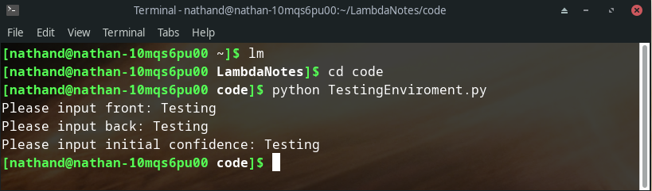

This works to the current rules of validation (entries are not null), however since confidence must be one of three values, 'good' or 'okay' or 'bad', for the following algorithms to decide the suggestion order I will add extra validation for this entry field.

Testing invalid inputs:

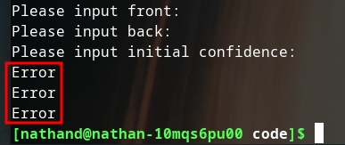

Although this works (it exits with an error), it is not optimal to have the error message printed thrice.

The following code iteration implements fixes for both 'issues' above:

```python 
#from FlashcardFunctions.py, from class AddFlashcard

    def GetInput(self): #will need to be updated when packaged into a GUI.
        valid = True #used to check input is valid
        front = input("Please input front: ")
        back = input("Please input back: ")
        conf = input("Please input initial confidence: ")
        validConf = ['good', 'okay', 'bad'] #set of valid confidences, in list form for possibility of extra options in the future. 
    
        if not front: #the following statements check the inputs are not null, and if they are, change the valid variable accordingly.
            valid = False
        if not back:
            valid = False
        
        if conf not in validConf: #checks if users input is not in set of valid inputs. 
            valid = False

        if valid == False:
            print("Error")
            quit() #quits if inputs are invalid
            
        self.inputsList = [front, back, conf] #adds the three inputs into a list.
```

Running the test script now with the same inputs as last time:

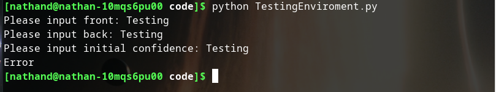

In this test, there is now an error thrown up. This is due to 'Testing' not being in the list of valid confidence settings.

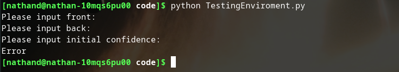

This test data now results in only one error message being outputted, which is what was wanted.

This subroutine now completes its job as required, therefore I am happy to move on to another. 

#### CardPointer

This function is the first that have been implemented in this class to use the SQLite3 functionality. Therefore, before I start coding the functionality, I need to make some additions to what has already been made:
Firstly, I put the import statement at the top of the FlashcardFunctions.py file, as so:

```python
import sqlite3 as sql
```

Next, I add to the AddFlashcard class constructor:

```python
def __init__(self, database):
    self.queueFlowType = None
    con = sql.connect(database)
    self.cur = con.cursor()
```

This creates a cursor object as we did in the SQLite3 testing, however this time it is a class attribute.

Now, I create the CardPointer function, and add some preliminary code:

```python
#from FlashcardFunctions.py, in class AddFlashcards

    def CardPointer(self):
        res = self.cur.execute(''' SELECT MAX(CardID)
                                      FROM Flashcards; ''') #executes transaction on database, to gain knowledge of current highest cardID. Use of 'res' is standard practice for SQLite package.
        cardID = res.fetchall() #fetches result of SQL transaction
        print(cardID)
```

To test this, I will edit TestingEnvironment.py, and create a database using a new script for prototyping called FlashcardDatabase.py:

TestingEnvironment.py:
```python
import FlashcardFunctions as Ff

Adder = Ff.AddFlashcards("databases/Flashcards.db") #to create AddFlashcard 'Adder' object

#print(Adder.ConfigCheck())

#Adder.GetInput()

Adder.CardPointer()
```

FlaschardDatabase.py:
```python
import sqlite3 as sql #imports package into Python under more efficient name

con = sql.connect("Flashcards.db") #creates a connection to the database test.db.
# Flashcards.db will be created in the current working directory if not already made.

cur = con.cursor() #creates a database cursor which is needed to execute statements and retrieve data.

cur.execute("""
            CREATE TABLE Cardset(
            setID int primary key NOT NULL,
            setName varchar NOT null
            );""")

cur.execute("""            
            CREATE TABLE Flashcards(
            cardID int primary key NOT NULL,
            front varchar NOT NULL,
            back varchar NOT NULL,
            significance float NOT NULL,
            setID int NOT NULL,
            CONSTRAINT FK_setID foreign key (setID)
            REFERENCES Cardset(setID)
            );
            """) #creates tables

cur.execute("""
            INSERT INTO Cardset(setID, setName) VALUES (001, "Computer Science");
            """)

cur.execute("""
            INSERT INTO FLashcards
            (cardID, front, back, significance, setID) VALUES (001, "a", "b", 10.0, 001);
            """)

con.commit() #commits the transactions
```
The above code uses the same SQL table definitions as in 3.1.1.1. When I run TestingEnvironment now, the max CardID should simply be 1. 
Testing this:

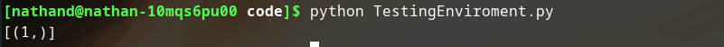

The numerical answer is correct, however it is in a sub-optimal format. It is clear that the data is being stored as a list of tuples, and so to fix this I changed the code to the following:

```python
#from FlashcardFunctions.py, in class AddFlashcard

        cardID = res.fetchall() #fetches result of SQL transaction
        cardID = cardID[0][0] #isolates value from list of tuples
        print(cardID)
```

At this point, I realise that the code has not got a manner in which the Cardset to be search can be defined. To change this, I add an additional parameter (the setID) and then add to the SQL statement to narrow down the options:

```python
#from FlashcardFunctions.py, class AddFlashcard

    def __init__(self, database, setID):
        self.queueFlowType = None
        con = sql.connect(database)
        self.cur = con.cursor()
        self.setID = setID

--------------------------------------------------------- lines emitted for ease of reading.

#from CardPointer()

        res = self.cur.execute(""" 
                                SELECT MAX(CardID)
                                FROM Flashcards
                                WHERE setID = ?;""", (self.setID,)) #executes transaction on database, to gain knowledge of current highest cardID. Use of 'res' is standard practice for SQLite package. Use of '?' is sqlite3 method for inputting variable into the statement. 
```
Since the class now takes an extra parameter on instantiation, the testing script must be changed accordingly:

```python
#from TestingEnvironment.py

import FlashcardFunctions as Ff

Adder = Ff.AddFlashcards("databases/Flashcards.db", '1') #to create AddFlashcard 'Adder' object

#print(Adder.ConfigCheck())

#Adder.GetInput()

Adder.CardPointer()
```

You can see that I am using setID '1', since that is the only Cardset currently in the database created earler:

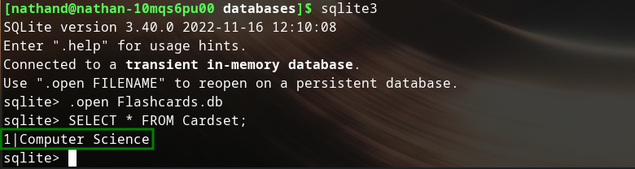

Since there is also only one flashcard in this deck, the output when TestingEnvironment.py is ran should be identical to last time. Running the script,

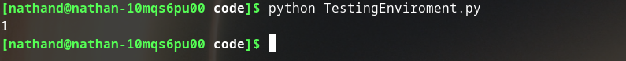

confirms that this is the case. 

The next step to doing preliminary testing is to add/remove flashcards through this SQLite3 interface, and rerunning the test. 
In the following examples, I will show the flashcards added (the contents of which will simply be placeholder) through said interface and the resulting output of TestingEnvironment being ran.

Firstly, I add 2 extra flashcards of cardID 2 and 10. 

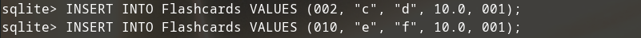

The max cardID in the Computer Science Cardset is now clearly 10. Running TestingEnvironment.py shows the code is working correctly, identifying 10 as the max cardID:


To further test whether the code can account for removals of cards, I use the SQLite interface to remove the flashcard with cardID 10:

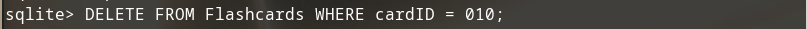

Now the max cardID in the specified Cardset is 2, and is correctly outputted when running the test script:


At this point, I am happy the code is doing what it is expected to, and I can continue on to implement the next subroutine.

#### NewQueue + EnQueue

NewQueue is a very simple subroutine. All it must do is creat an empty list/queue that can be subsequently appened to if necessary. 
EnQueue is similarly easy to implement, since it just needs to be a generalised/asbtracted function to add to any given list.

The two subroutines are made to be abstracted, they are generalised and so are in the General class.
The code is as follows:

```python
#from FlashcardFunctions.py

class General: #class for general function that may be used my any of the proceeding classes.

    def NewQueue(): #creates list to act as queue.
        queue = []
        return queue

    def EnQueue(queue, element): #takes in a pointer to a list and the element to be added, and appends the element to the list.
        queue.append(element)
```
The ease of creating lists in Python compared to, say, arrays in C++ makes these two subroutines somewhat redundant in that they could be written locally in which ever subroutine is using them. I have decided to write them in this way sinceit allows for personalisation of the built in Python functions should I ever want to do it, as well as making it easier for potential 'other-language' developers to port it over (it is clearer to them that a subroutine must be written for these functions).

ADD TESTING LATER.


#### FormatInputSQL

Now we have a function that can assign the primary key to an entry in the Flashcard table, it is a good time to write the subroutine that can format the users previous inputs into SQL. Originally I had planned to use string concatenation to create the SQL statement. However, after learning of SQLite's method of using '?' to denote where variables defined in a second parameter will be placed (I first used this in the CardPointer function), this is clearly better. 

Since the subroutine must be compatible with both addition flow types (as defined by the users set up in the configuration file), the subroutine's return must not be based on which flow type is being used, but a general method that works for both. 
Because of this ensured compatibility, I will also place the cursor.execute statement in this subroutine; this means that FormatInputSQL will be the last step for the flashcard data before it is commited to the database. Note, however, that the actuall *commit* statement will only be executed in the FormatInputSQL subroutine **if** the flow type is non-queue. If the queue is being used, the commitstatement will be placed in the DeQueue function, after FormatInputSQL has been called on all the queue elements.

I write out the statement as follows:


```python
#from FlashcardFunctions.py, AddFlashcard class

    def FormatInputSQL(self):
        cur.execute("""
                    INSERT INTO Flashcards(cardID, front, back, significance, setID)
                    VALUES (?, ?, ?, 10, ?);""", (self.CardPointer()+1, self.front, self.back, self.setID))
``` 

Before this can work a change must be made to the code; the CardPointer function is edited to return the current highest cardID rather than print it, e.g.:
```python
return cardID
```
This allows the code to call upon the function as used in the SQL statement above. 

I realise at this point that the use of object oriented variable here (e.g. self.inputsList[0] can be thought of as self.front etc.) become redundant when the queue flow type is being used. It would be necessary, as the code is currently written, to redefine self.front and self.back every time a new flashcard data array was popped from the queue. To counter this, I use Python's ability to set default parameters. This means when the queue data type is not being used, the object variables can be used in a simple flow from input to SQL commit, but when the queue is being used we do not need to redefine these variables every time:

```python
#from FlashcardFunctions.py, AddFlashcard class

    def FormatInputSQL(self, front=self.inputsList[0], back=self.inputsList[1]):
        self.cur.execute("""
                    INSERT INTO Flashcards(cardID, front, back, significance, setID)
                    VALUES (?, ?, ?, 10, ?);""", (self.CardPointer()+1, front, back, self.setID))
```

To test this I first changed TestingEnvironment to the following:
```python
import FlashcardFunctions as Ff

Adder = Ff.AddFlashcards("databases/Flashcards.db", '1') #to create AddFlashcard 'Adder' object

#print(Adder.ConfigCheck())

#Adder.GetInput()

Adder.GetInput()

Adder.FormatInputSQL()
```

This aims to add to the database in a fashion that resembles the linear, non-queue flow type. When ran, however, it gives the following output:

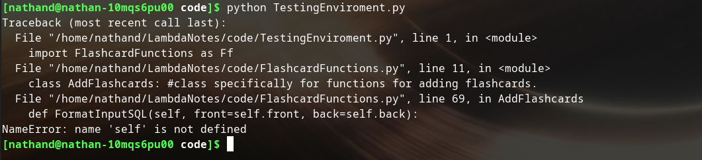

NOTE NEED TO REMAKE THIS FAIL. WARNING WARNING WARNING!!!!!!!!!!!

After some research, I remember this is failing due to how python evaluates default arguments (at definition not during run time). To combat this I change the value of the default arguments to None and then use a selection statement to achieve the desired effect:

```python
#from FlashcardFunctions.py, AddFlashcard class

    def FormatInputSQL(self, front=None, back=None):
        if front == None:      #This set of statements is to use the obejct variables if required.
            front = self.inputsList[0] #It is unlikely one would be None and the other not, but I still include the check for robustness.
        if back == None:
            back = self.inputsList[1]

        self.cur.execute("""
                    INSERT INTO Flashcards(cardID, front, back, significance, setID)
                    VALUES (?, ?, ?, 10, ?);""", (self.CardPointer()+1, front, back, self.setID))"""
```

This code now doesn't throw up any errors when TestingEnvironment.py is run, however since their is no commit statement, we cannot checkit is being added correctly.

Since I only want the commital of the transactions to be done here if the user is not using the queue flow type, I will add a statement to check for this. The final iteration, at this stage, of the code is as follows:

```python
#from FlashcardFunctions.py, AddFlashcard class

    def FormatInputSQL(self, front=None, back=None):
        if front == None:      #This set of statements is to use the obejct variables if required.
            front = self.inputsList[0] #It is unlikely one would be None and the other not, but I still include the check for robustness.
        if back == None:
            back = self.inputsList[1]

        self.cur.execute("""
                    INSERT INTO Flashcards(cardID, front, back, significance, setID)
                    VALUES (?, ?, ?, 10, ?);""", (self.CardPointer()+1, front, back, self.setID))
        
        if self.queueFlowType == False:
            self.con.commit()
```
Before I test this, I will clear the flashcards already in the database:

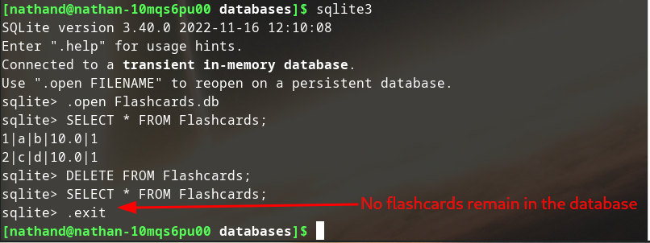

I also change the config file to set queueFlowType to False and rewrite the testing script to prompt the user to input three flashcards. Note that the initial confidence is actually having no effect at the moment, it is simply to give the user the impression that it is being used. It has no use until it is reinputted at review time (although later versions of the software may use it should the sorting algorithm be updated). 

```python
#from TestingEnvironment.py

import FlashcardFunctions as Ff

Adder = Ff.AddFlashcards("databases/Flashcards.db", '1') #to create AddFlashcard 'Adder' object

Adder.ConfigCheck()

for i in range(0,3):
    Adder.GetInput()
    Adder.FormatInputSQL()
    i += 1
```

However, an error arose when trying to run this:

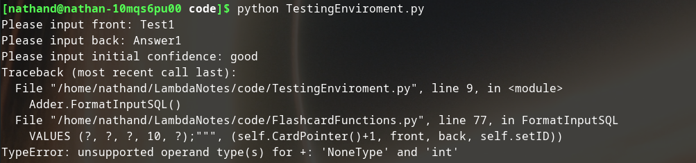

Upon seeing this I realise that this is because when there is no flashcard already in the database, the return of the CardPointer will be null since there is no maximum cardID. This is an easy fix however, and so I implement a check in the CardPointer function to account for this:

```python
### from FlashcardFunctions.py, AddFlashcard class, CardPointer subroutine

    def CardPointer(self):
        res = self.cur.execute(""" 
                                SELECT MAX(CardID)
                                FROM Flashcards
                                WHERE setID = ?;""", (self.setID,)) #executes transaction on database, to gain knowledge of current highest cardID. Use of 'res' is standard practice for SQLite package.
        cardID = res.fetchall() #fetches result of SQL transaction
        cardID = cardID[0][0]
        
        if cardID is None:
            cardID = 1

        return cardID
```

This removes the error when the testing script is run, and so the interaction during run time looks like so:

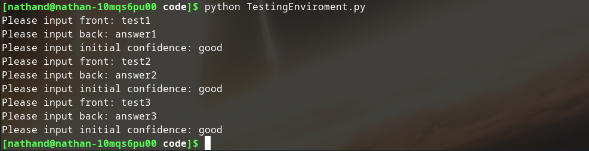

Checking this has worked using the SQLite interface:

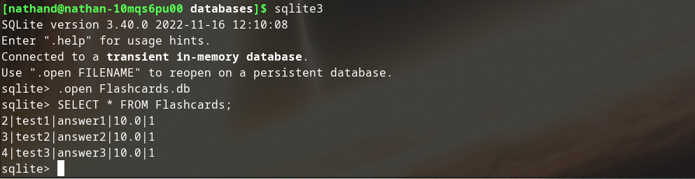

We can see this has mostly been a success (the cardID is incrementing and everything has been formatted as desired). However, notice that the cardID starts at 2 rather than 1, which is just an error due to me forgetting that the FormatInputSQL subroutine adds one to the cardID. To fix this I change the value of CardID to 0 in the CardPointer subroutine when it is the first flashcard being added to a cardset.
