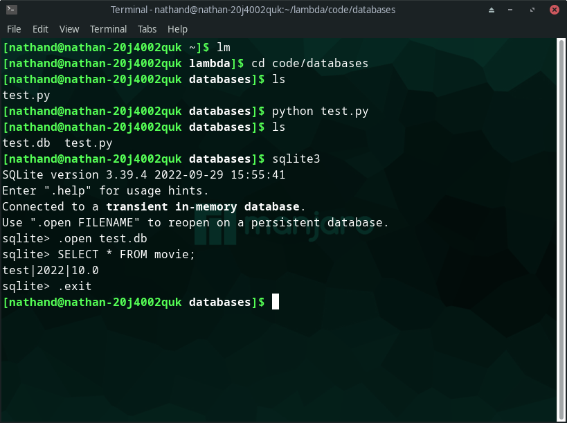

# Implementation 

## Flashcard System

### Database 

#### Raw SQL Prototype

Note: I have named prototype 'Raw SQL' since it is written and tested in pure SQL form, rather than linked into Python like the final product is planned to be. 


In section 2.3.3., there was an ERD presented. To make sure this system works, I will implement this into SQL and trial some basic transactions. Further testing of the final product will be carried out once the functionality from Python is implemented. 

The following is the SQL definitions of the tables. The SQL seen here was written in Repl.it's SQLite environment.

```sql
CREATE TABLE Cardset(
   setID int primary key NOT NULL,
   setName varchar NOT NULL
);

CREATE TABLE Flashcards(
   cardID int primary key NOT NULL,
   front varchar NOT NULL,
   back varchar NOT NULL,
   significance float NOT NULL,
   setID int NOT NULL,
   CONSTRAINT FK_setID foreign key (setID)
   REFERENCES Cardset(setID)
);
```

First, I added a cardset:

```sql
INSERT INTO Cardset
(setID, setName) VALUES (01, "Biology");
```

Using the setID of this cardset, I added a flashcard into said set:

```sql
INSERT INTO Flashcards
(cardID, front, back, significance, setID) VALUES (01, "What is the job of the ribosome?", "Proteinsynthesis", 10, 01);
```

To test whether the use of a foreign key is working in this relational database, I implemented a transaction using a table join:

```sql
SELECT Flashcards.front, Flashcards.back, Cardset.setName
FROM Flashcards INNER JOIN Cardset
ON Cardset.setID = Flashcards.setID;
```

Carrying this out resulted in the following output:

```
What is the job of the ribosome?|Proteinsynthesis|Biology
```

This is the desired output and shows that the planned structure of the database is viable.

In the *Design* section, it was said there would be a function of the program to check for duplicate fronts. I intend to fully implement this at a later point, however I did implement the following: 

```sql
INSERT OR IGNORE INTO Flashcards
(cardID, front, back, significance, setID) VALUES (01, "What is the job of the ribosome?", "Proteinsynthesis", 10, 01);
```

The change here is the addition of the OR IGNORE. This means a exact duplication of an earlier entry will be discarded. This also helps handle the potential for an error arising from a non-unique primary key. To make sure this was working, I carried out the following:

```sql
INSERT OR IGNORE INTO Flashcards
(cardID, front, back, significance, setID) VALUES (01, "What is the job of the ribosome?", "Proteinsynthesis", 10, 01);

INSERT OR IGNORE INTO Flashcards
(cardID, front, back, significance, setID) VALUES (01, "What is the job of the ribosome?", "Proteinsynthesis", 10, 01);

SELECT * FROM Flashcards;
```

This resulted in the output I wanted for now:
```
01|What is the job of the ribosome?|Proteinsynthesis|10.0|01
```

This method, however, is not perfect. This is because I plan to increment the cardID by one for each card added, and so by this method there wont be any discarding of duplicates, even when the content of the flashcards are identical. For example:

```sql
INSERT OR IGNORE INTO Flashcards
(cardID, front, back, significance, setID) VALUES (01, 'a', 'b', 10, 01);

INSERT OR IGNORE INTO Flashcards
(cardID, front, back, significance, setID) VALUES (02, 'a', 'b', 10, 01);

SELECT * FROM Flashcards;
```

Results in: 
```
01|a|b|10.0|01
02|a|b|10.0|01
```
Which is not what I want in the final implementation. I will keep the OR IGNORE feature for now since it does prevent a possible error.

### Setting Up SQLite3 in Python

At this stage I have already downloaded SQLite3 using my native linux package manager. This section is to confirm the package is working correctly, and can be used to create and retrieve from databases as required by the program.

Since I have not used this format previously, I am using the documentation at: 
```
htttps://docs.python.org/3/library/sqlite3.html. 
```
For ease, I will follow their tutorial page to some extent to use as a simple program to check everything is wokring as expected.

Picking relevant parts of the tutorial from the documentation led to me having the following code. Note that I have changed some of their code to display, in my opinion, more robust SQL both in syntax and in formatting.

```python
import sqlite3 as sql #imports package into Python under more efficient name

con = sql.connect("test.db") #creates a connection to the database test.db.
# test.db will be created in the current working directory if not already made.

cur = con.cursor() #creates a database cursor which is needed to execute statements and retrieve data.

#to create table:
cur.execute("""CREATE TABLE movie(
            title varchar primary key,
            year int,
            score float
            )""") #uses the cursor to execute the SQL on the database currently connected.

#to add a record into the table:
cur.execute("INSERT INTO movie(title, year, score) VALUES ('test', 2022, 10.0)")

con.commit() #commits the transactions
```

This was stored under file name 'test.py'. 


Above you can see that initially *test.py* is the only file in lambda/code/databases which is the directory I am working in. I then execute the code, and use ls (the linux command to show the contents of a directory) again to show that test.db has been created. This means the package is working and has successfully connected to a database. 

To check the other transactions have successfully completed I will use the console based SQLite interface:



I enter sqlite3 into the console to open the interface, use .open test.db to open the database just created, and then can execute SQL in a standard fashion. The output to the SELECT statement confirms the table *movie* has been created as exepcted, and a record has been added in its correct form. 

I am now happy SQLite3 is working correctly in its Python implementation and can move on to implementing LambdaNote specific scripts.

### Setting up FlashcardFunctions Library


### User Adds Flashcards

In section 2.4.5, I laid out a clear design for the functions that would be needed to create the function of a user adding a flashcard to any specified database. I now will implement it and test it according to the specifications in 2.4.5. 

