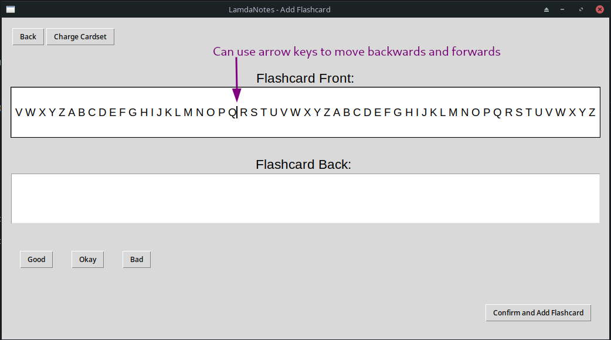

# Evaulative Testing

## Function Testing


### Adding Flashcards

#### Valid Testng

**Aim**: I will try to put very long front and backs into the addition window and see how it responds

**Evidence**:




**Bugs Found**: This test did not yield any major errors. Long inputs extend the entry field box rather than distrupting the window geometry, which is good. 
The arrow keys can be used to navigate the entry field which is a suitable solution to the problem.

**Fixes**: No fixes necessary.

#### Erroenous Testing

**Aims**:

- I will try to add a card with empty front and backs

- I will try to add a card without setting a confidence

**Evidence**:

- See AddingFlashcardsErrorTest1.mp4
- See AddingFlashcardsErrorTest2.mp4

**Bugs Found**:

- Application shuts down if cards have empty fronts and back
- Error messages displayed if confidence is not set 

**Fixes**:

Added check for empty fields in PrelimUI.py:

```python
def confirmAdd(self):
  front = self.front.get()
  back = self.back.get()
  if len(front) == 0: #(added checks)
    return
  if len(back) == 0:
    return
  try:
    conf = self.confidence
  except:
    return
  UI.AddFlashcard(track.setID, front, back, conf)
  self.FlashcardFrontEntry.delete(0, tk.END)
  self.FlashcardBackEntry.delete(0, tk.END)
```

To see this now working, see AddingFlashcardsErrorTestFix.mp4


### Revising Flashcards

#### Valid Testing

**Aim**: I will try using the revision window when there is only 1, 2 and 3 cards in the chosen cardset.

**Evidence**:

- Only 1 Card: See RevisingFlashcardsTest1.mp4

- Only 2 Cards: See RevisingFlashcardsTest2.mp4


- Only 3 Cards: See RevisingFlashcardsTest3.mp4 (No Problems Found)

**Bugs Found**:

- When the cardset only has 1 card, no cards show up in the revision tab

- When the cardset only has 2 cards, it gets stuck on one flashcard after a few revisions

- The window often cuts out the card information, because the geometry is too small

**Fixes**: 

- Regretfully I do not have time between finding the first two errors and fixing them, therefore please see the Fix Plan section below. 

- The final error, to do with the window geometry can be fixed by removing the definition of a fixed Tkinter geometry in the PrelimUI file. I have made this change and this fixes the error.

**Fix Plan**: Change / restructure the way the program handles indexes in retrievals so that all references stay in the correct range.

#### Erroneous Testing

**Aim**: I will try opening the revision window using an empty cardset.

**Evidence**:


**Bugs Found**: The window stays open but empty, however an error is printed to the console.

**Fixes**: This will be sorted in the index restructure described above.


### Removing Flashcards

**Aims**: (Erroneous Testing): I will see how the program reacts when I click to remove a flashcard when:
  
  - The chosen cardset is populated and I have no card selected.
  
  - The chosen cardset is empty.

**Evidence**: See RemovingFlashcardsTest1.mp4

**Bugs Found**: No Bugs

**Fixes**: N/A


### Mind Map Creation

#### Valid Testing

**Aims**:
- I will attempt to create a mind map with only one node.

- I will attempt to create a mindmap with approx. 15 elements.

**Evidence**:

- png file of one-node mind map is blank

- Output of second test:


**Bugs Found**: When there is only one node, no proper output

**Fixes**: I don't believe a fix is needed, however an area for improvement could be to not create the file at all when there is only one node.

#### Erroneous Testing

**Aim**: I will see how the program reacts when I click to create a mindmap when no nodes have been added.

**Evidence**:

- png file of one-node mind map is blank

**Bugs Found**: No bugs

**Fixes**: No fixes, although room for improvement in that no file should be created.


## User Simulation Testing

The following sections will document how I went about carrying out the test plans described in the test planning section of *Design*.

#### Technologically Adept Student

To see a time-lapse of the test, see TestTimeLapse1.mp4 

**Usability Issues Noted**: 

- Chosen entry field doesn't automatically switch back to front entry once previous entries have been added

- Confidnce buttons on retrieval do not stay in the same place nor do they stay the same size

**Maintanence Plan**: Since this is an artifact of the prelimary UI, I will eradicate this when the software migrates to its next GUI engine (see later sections).


#### Business Management

To see a time-lapse of the half of the test, see TestTimeLapse2.mp4. The second half included the creation of the second, smaller, mindmap and was not recorded.

Resultant mind maps:


**Usability Issues Noted**:

- Hard to remember exact names of nodes to back track to
- Can only create one mind map before you have to retrieve file, otherwise original file will be overwritten

**Maintanence Plan**: In the future I will create a frequently updating viewing window of the current mind map so that you can see it as you expand it. I will also add an option to choose from a list the node you want to back to.


## Stakeholder Testing 

### Pre-Test Interviews

I briefed all my stakeholders on the current state of the project, and decided to ask them a few questions before they decided to test. Furthermore, due to time constraints the current build does not have a GUI method to create cardsets, therefore I asked my stakeholders prior to the test which cardsets they would want and implemented them for them.

**The Questions**:

- Q1: How are you feeling about testing LambdaNotes?

- Q2.1: (For Rupert and Alex) - Have any of your opinions on revision changed since we last spoke?

- Q2.2: (For Gretchen) - Have you tried any new methods of planning since we last spoke?

- Q3: Have you thought of anything else you'd like in LambdaNotes that could be implemented at a later date, before you actually test the software?

**Rupert**:

- Q1: "I'm looking forward to it. It could be helpful."

- Q2: "I've started to do slightly more. I've actually used mind maps more after we talked about them in our first interview. Flashcards still seem like a lot of effort though."

- Q3: "No, I'm going in with an open mind."

**Alex**:

- Q1: "I'm excited, I've enjoyed seeing it come together and I'm looking forward to finally being able to try using it. I know it is only a preliminary build but it will be interesting to see its potential."

- Q2: "I've stuck to my method of revision, I haven't felt the need to change anything since it has been working well. However, I am not opposed to the idea of incorporating this new software into my routine."

- Q3: "I'm aware that you can't see the mindmap as you make it, it's not a deal breaker but it seems slightly clumsy"

**Gretchen**: 

- Q1: "I'm interested to see how intuitive it is and decide if it would be worth using it.

- Q2: "Nope, stuck with my trusty paper!"

- Q3: "Not really, I've been too busy. (Laughs)"

### The Test Results

The following table documents what each stakeholder used the software for:

|      | Rupert | Alex | Gretchen |
|------| ------ | ------ | ------- |
| Used the flashcard features | Yes | Yes | No |
| | | | | 
| Used the mind map functtion | Yes | Yes | Yes |
| | | | | 
| Number of flashcards created (approx.) | 30 | 50 | 0 |
| | | | | 
| Number of mind maps created | 1 | 2 | 4 |


The following table documents the stakeholders response to numerous post-test questions:

|    | Rupert | Alex | Gretchen |
|---- | ------ | ------ | ------ |
| Did you enjoy using LambdaNotes? | "It was alright, as revision goes" | "Yes" | "Yes" |
| | | | | 
| What did you enjoy most? | "The flashcards, I'm surprised how useful I found them!" | "I liked them both, but I spent more time using the flashcards." | "The mind maps; they are output very nicely" |
| | | | | 
| What needs improving? | "Just make the UI seem more modern." | "I would say, as I suspected, the mind map feature needs a live viewer" | "I would like a way to see the mind map as I make it" |
| | | | | 
| Would you use LambdaNotes again? | "Yes, I think it could be helpful." | "Yes, I am excited for its next steps." | "I think I will attempt to integrate it into my workflow" |

The feedback is overall on the positive side with a recurring theme in that a live preview is needed. 

Further evaluation will be given in the next section.