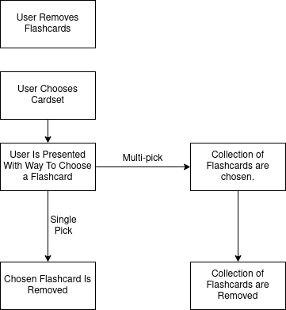
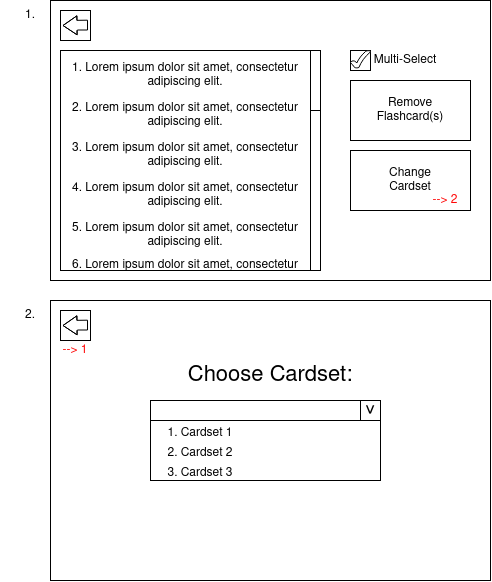

## User Removes Flashcard

The following diagram shows a decomposed view of what this section of the code must achieve:

**ADD LINKS TO SUCCESS CRITERIA LATER**

### Preliminary UI Design

After starting implementation, it became clear that it would be advantageous to implement this section into a GUI outcome. Before doing this, I layed out what I wanted to achieve and designed it accordingly:

**Aims of the Preliminary UI**:
- To create a space to implement and test this feature
- To prepare the code to be implemented into a final UI product
- To use the experience to inform how the final UI will look

**Design**

The above diagram shows the two pages of UI that I want to implment at this point. 

You can see the window I have labelled as '1.' will be the main one and can be seen to contain the following:
- A scroll list containing all the flashcards in a given cardset
- A option to multi-select, which removes the necessity of the user having to click a flashcard then click remove over and over
- A button to confirm the removal of chosen flashcard(s)
- A button to go to another window (denoted '2') to change the cardset being used

The second window (2) contains a drop down list containing all the cardsets that have been created. 

I will refer to, in the implementation, the main window as MainRemovalWin and the cardset choice as ChangeCardset. 
