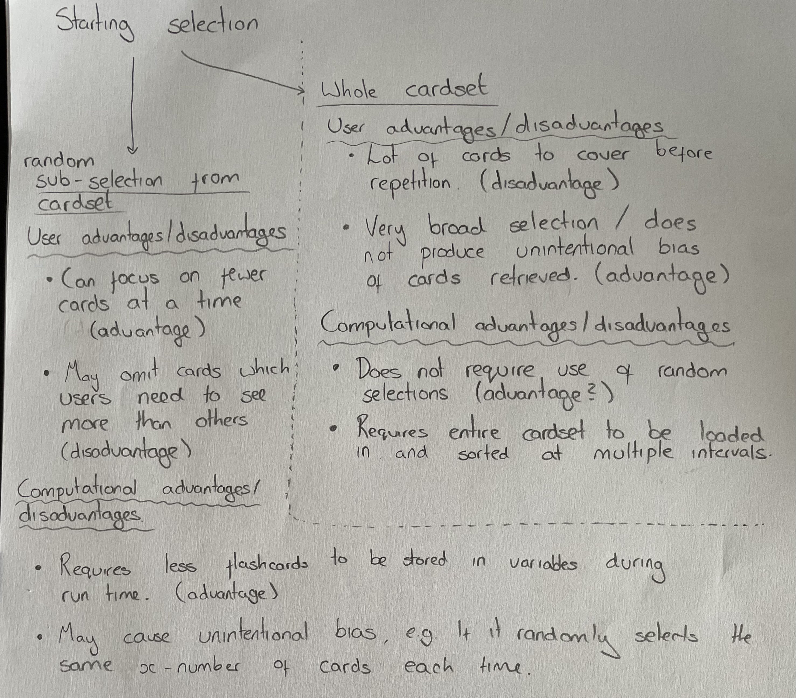
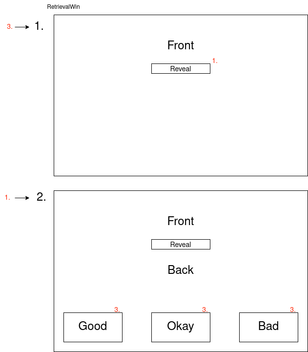
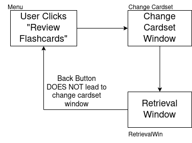

## Flashcard Selection Algorithm

It can be argued that the most important algorithm in the flashcard section of LambdaNotes is the actual algorithm that dictates the order the flashcards are presented to the user for review. 

I will design two algorithms which work differently, and then test this using stakeholders to see what they find the most useful. For the scope of this project, I will implement the first algorithm however in the future once I carry out the human tests to determine the performance deltas between the two methods I will then change the optimal one into a computational equivalent (turn the pseudocode/flowchart into Python code and embed it in the GUI).

### Brainstorming  

To initially come up with ideas of how the algorithms could work, I used paper to layout possible ideas:



You can see I came up with the idea of two different starting selections (the initial cards that will be tested and sorted). In the following section, I will lay out pseudocode for the two solutions.

### Pseudocode Algorithms - Iteration 1

#### Random Sub-selection 

```
USE RANDOM #use some kind of random library

setID = INPUT
setSize = integerVal #dictates size of random sub-selection

list = LOAD ALL (cardID) FROM DATABASE WHERE (setID) == setID 
# creates a list of all cardID's in the current cardset

endList = [] #creates empty list

FOR i IN RANGE(0, setSize)
    element = RANDOM.CHOICE(list) #selects random element from given list
    elementSignificance = LOAD (significane) FROM DATABASE WHERE (cardID) == element #loads significance of randomly selected element
    endList.APPEND([elementSignificance, element])
    list.REMOVE(element)
NEXT i

FUNCTION retrieval 
    SORT ASCENDING ON endList(elementSignificance) #sorts list order to ascending values of the elementSignificance of each item.
    id = endList[0][1] #isolates chosen cardID in id var
    front = LOAD (front) FROM DATABASE WHERE (cardID) == id #loads relevant flashcard info from database (same below)
    back = LOAD (back) FROM DATABASE WHERE (cardID) == id
    OUTPUT front #shows user front
    ON BUTTON: OUTPUT BACK #reveals back on button click
    ON BUTTON: GET confidence #retrieves updated confidence on button click
    IF confidence == good THEN
        endList[0][0] = endList[0][0] + (3 + RANDOM.DECIMAL(-0.5, 0.5))
        UPDATE significance IN DATABASE WHERE (cardID)==id
        DATABASE CHANGE COMMIT
    ENDIF
    IF confidence == okay THEN
        endList[0][0] = endList[0][0] + (0 + RANDOM.DECIMAL(-0.5, 0.5))
        UPDATE significance IN DATABASE WHERE (cardID)==id
        DATABASE CHANGE COMMIT
    ENDIF
    IF confidence == bad THEN
        endList[0][0] = endList[0][0] + (-3 + RANDOM.DECIMAL(-0.5, 0.5))
        UPDATE significance IN DATABASE WHERE (cardID)==id
        DATABASE CHANGE COMMIT
    ENDIF
ENDFUCTION

WHILE EndButton NOT PRESSED: #continually runs the retrieve function unless interrupted
    retrieval()
ENDWHILE
```

You can hopefully see that this algorithm randomly chooses a set number of flashcards from the overall cardset, and then continually sorts and outputs to the user so that they can revise them.

#### Whole Cardset Selection

```
USE RANDOM #use some kind of random library

setID = INPUT

result = LOAD ALL (cardID) FROM DATABASE WHERE (setID) == setID 

list = []

FOR i IN RANGE(0, LENGTH(result))
    significance = LOAD (significance) FROM DATABASE WHERE (cardID) == result[i]
    list.append([ significance, result[i] ])
NEXT i

FUNCTION retrieval 
    SORT ASCENDING ON list(significance) #sorts list order to ascending values of the significance of each item.
    id = list[0][1] #isolates chosen cardID in id var
    front = LOAD (front) FROM DATABASE WHERE (cardID) == id #loads relevant flashcard info from database (same below)
    back = LOAD (back) FROM DATABASE WHERE (cardID) == id
    OUTPUT front #shows user front
    ON BUTTON: OUTPUT BACK #reveals back on button click
    ON BUTTON: GET confidence #retrieves updated confidence on button click
    IF confidence == good THEN
        list[0][0] = list[0][0] + (3 + RANDOM.DECIMAL(-0.5, 0.5))
        UPDATE significance IN DATABASE WHERE (cardID)==id
        DATABASE CHANGE COMMIT
    ENDIF
    IF confidence == okay THEN
        list[0][0] = list[0][0] + (0 + RANDOM.DECIMAL(-0.5, 0.5))
        UPDATE significance IN DATABASE WHERE (cardID)==id
        DATABASE CHANGE COMMIT
    ENDIF
    IF confidence == bad THEN
        list[0][0] = list[0][0] + (-3 + RANDOM.DECIMAL(-0.5, 0.5))
        UPDATE significance IN DATABASE WHERE (cardID)==id
        DATABASE CHANGE COMMIT
    ENDIF
ENDFUCTION

WHILE EndButton NOT PRESSED: #continually runs the retrieve function unless interrupted
    retrieval()
ENDWHILE
```

You can see the pseudocode for this version is very similar to the method previously described. The only big difference is that the retrieval function works with and sorts a list of every flashcard in the given cardset.

#### Sort Functionality  

I will use a bubble sort to implement the needed sorting functionality.

```
FUNCTION sort(list):
    FOR Pass IN RANGE(0, LENGTH(list)-2)
        FOR i IN RANGE(0, LENGTH(list)-1-Pass)
            IF list[i][0] > list[i+1][0] THEN
                temp = list[i]
                list[i] = list[i+1]
                list[i+1] = temp
            ENDIF
        NEXT i
    NEXT pass
ENDFUNCTION
```

### Pseudocode Algorithms - Iteration 2 

After the completion of the initial pseudocode design of the major algorithms needed (but before any implementation), I thought some more about the way cards were being sorted.

I decided it would be advantageous for the list to not be sorted *every* time a card is revised, but at a set interval. For now, I will set this interval to every 3 cards. 

Since this change only affect the retrieval function, which is identical across both options of cardset size methods (except naming conventions), I will illustrate the change on only the *Random Sub-set* version:

```
FUNCTION retrieval 
    SORT ASCENDING ON endList(elementSignificance) #sorts list order to ascending values of the elementSignificance of each item.
    FOR i IN RANGE(0, 3)
        id = endList[i][1] #isolates chosen cardID in id var
        front = LOAD (front) FROM DATABASE WHERE (cardID) == id #loads relevant flashcard info from database (same below)
        back = LOAD (back) FROM DATABASE WHERE (cardID) == id
        OUTPUT front #shows user front
        ON BUTTON: OUTPUT BACK #reveals back on button click
        ON BUTTON: GET confidence #retrieves updated confidence on button click
        IF confidence == good THEN
            endList[i][0] = endList[i][0] + (3 + RANDOM.DECIMAL(-0.5, 0.5))
            UPDATE significance IN DATABASE WHERE (cardID)==id
            DATABASE CHANGE COMMIT
        ENDIF
        IF confidence == okay THEN
            endList[i][0] = endList[i][0] + (0 + RANDOM.DECIMAL(-0.5, 0.5))
            UPDATE significance IN DATABASE WHERE (cardID)==id
            DATABASE CHANGE COMMIT
        ENDIF
        IF confidence == bad THEN
            endList[i][0] = endList[i][0] + (-3 + RANDOM.DECIMAL(-0.5, 0.5))
            UPDATE significance IN DATABASE WHERE (cardID)==id
            DATABASE CHANGE COMMIT
        ENDIF
    NEXT i
ENDFUCTION
```

### Pseudocode Algorithms - Iteration 3

During implementation, I decided that for ease it would be better for the retrieve function to split down into smaller, more specialised functions. This allows another script to better control the flow of the code. 

Furthermore, during implementation the decision was made to use an OO paradigm, hence the following pseudocode will use Python's 'self' syntax to show how it will be used.

```
FUNCTION retrieveFront
    IF self.i > 3:
        SORT ASCENDING ON endList(elementSignificance) #sorts list order to ascending values of the elementSignificance of each item.
        self.i = 0
    ENDIF

    self.id = endList[i][1] #isolates chosen cardID in id var
    front = LOAD (front) FROM DATABASE WHERE (cardID) == self.id #loads relevant flashcard info from database (same below)
    OUTPUT front #shows user front

    self.i = self.i + 1
ENDFUNCTION

FUNCTION retrieveBack
    back = LOAD (back) FROM DATABASE WHERE (cardID) == self.id
    OUTPUT back
ENDFUNCTION

FUNCTION setConfidence(BTN INPUT)

    #confidence depends on state of variable dictated by buttons in UI file

    IF confidence == good THEN
        endList[i][0] = endList[i][0] + (3 + RANDOM.DECIMAL(-0.5, 0.5))
        UPDATE significance IN DATABASE WHERE (cardID)==self.id
        DATABASE CHANGE COMMIT
    ENDIF
    IF confidence == okay THEN
        endList[i][0] = endList[i][0] + (0 + RANDOM.DECIMAL(-0.5, 0.5))
        UPDATE significance IN DATABASE WHERE (cardID)==self.id
        DATABASE CHANGE COMMIT
    ENDIF
    IF confidence == bad THEN
        endList[i][0] = endList[i][0] + (-3 + RANDOM.DECIMAL(-0.5, 0.5))
        UPDATE significance IN DATABASE WHERE (cardID)==self.id
        DATABASE CHANGE COMMIT
    ENDIF
    
ENDFUCTION
```

#### PrelimUI Integration

To fit into the project build prototype, the retrieval process must have a graphical user interface. I design it to look like the following:



You can see that at the beginning of retrieving any one card, only the front is displayed, however once the user clicks reveal the back is displayed as well as the confidence buttons. Once the user chooses a confidence button, the next card is retrieved, returning the window to a state where only the front of the new card and the reveal button can be seen.

This dissappearing and reappearing functionality will require functions as such:

```
FUNCTION createHalf
    UI CREATE FRAME bottomHalfFrame
    UI POSITION bottomHalfFrame
    FRAME ADD WIDGETS {
        UI LABEL backLabel
        UI BUTTON good, COMMAND = CleanUp('good')
        UI BUTTON okay, COMMAND = CleanUp('okay')
        UI BUTTON bad, COMMAND = CleanUp('bad')
    }
ENDFUNCTION

FUNCTION cleanUP (confidence)
    PASS TO FILE(FlashcardsRetrieval) confidence
    UI DELETE FRAME
ENDFUNCTION
```
The CreateHalf function is intended to render the bottom half of the window upon being called (by the reveal button). The CleanUp function passes the confidence that is needed by the backend algorithm to where it is needed as well as destroying the UI widgets in the bottom half ready for the next flashcard.

Instead of the window having its own way to change cardset, when the user clicks from the menu to revise flashcards I will first make them visit the change cardset window that is used throughout the software:


