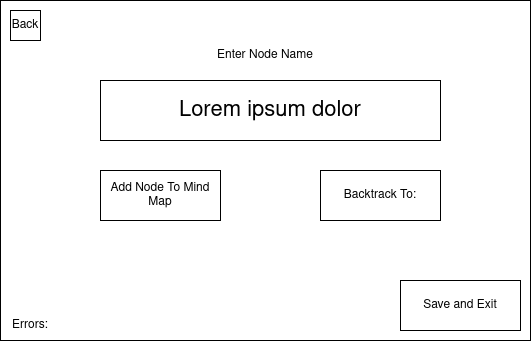

# Mind Maps

The following section of *Design* will document the design-oriented planning for the mind map section of LambdaNotes. By the time of designing this, I already know that I am using PrelimUI.py to package everything into the UI that will be used to present the state of the project at the end.

## Mind Map Creation

It can be seen in the Analysis section that I already have a proof of concept for this. It works as intended (please see the test inputs and outcomes) and so I will take this to be iteration 1 of the code. Rewriting this is a simplified pseudocode fashion:

### Iteration 1 - Pseudocode

```
IMPORT pydot AS pd

graph = pd.INSTANCE(TYPE, DIRECTION) #creates instance of graph

CLASS Node
    private _name
    private connections

    PUBLIC PROCEDURE New (name)
        _name = name
        connections = EMPTY LIST
    ENDPROCEDURE

    FUNCTION name:
        RETURN _name
    ENDFUNCTION

    FUNCTION connector(previousNode)
        connections.APPEND(previousNode)
        OUTPUT(connections) #prototyping
    ENDFUNCTION
ENDCLASS

CLASS MindMap
    private _nodes
    private _names

    PUBLIC PROCEDURE New (nodes, names)
        _nodes = nodes
        _names = names
    ENDPROCEDURE

    FUNCTION edges
        FOR i FROM 0 TO LENGTH(_names)
            parent = _nodes[_names[i]].name()
            for j FROM 0 TO LENGTH(_nodes[_names[i]].connections)
                edge = pd.ADD-EDGE(parent, _nodes[_names[i]].connections[j])
                ADD edge TO graph
    ENDFUNCTION
ENDCLASS

nodes = EMPTY DICTIONARY
names = EMPTY LIST

count = 0
lastNode = 0
firstNode = TRUE

WHILE TRUE:

    IF lastNode != 0 THEN
        currentIndex = names.INDEX(lastNode)
    ENDIF

    nextInput = INPUT

    IF "<" IN nextInput THEN
        IF nextIput[1:] IN nodes THEN
            lastNode = nextInput[1:]
        ENDIF
        ELSE 
            OUTPUT "Error"
        ENDELSE
    ENDIF
    ELSE IF nextInput == "exit" THEN
        BREAK
    ENDELSEIF

    ELSE
        IF nextInput NOT IN nodes THEN
            nodes[nextInput] = Node(nextInput)
            names.append(nextInput)
        ENDIF

        IF firstNode != TRUE THEN
            nodes[nextInput].connector(lastNode)
            lastNode = nodes[nextInput].name()
        ENDIF

        ELSE
            firstNode = False
            lastNode = nextInput
        ENDELSE
    ENDELSE

ENDWHILE

map = MindMap.New(nodes, names)
map.edges()

OUTPUT graph TO (IMG FILE)
```

The logic is pretty heavy here. The code uses both a dictionary and a list to store the needed information at run-time with some intricate iteration needed to transport data to where it is needed. 

Since it is working, I do not want to change the logic at all for iteration 2. Although the use of both a dictionary and a list is not the most elegant way to do this in my opinion, it works and will fulfill the success criteria of the project. Furthermore, for the size of mind maps the users will be using, this will not pose any memory issues. 

To keep the logic intact, iteration 2 will focus on creating the UI windowm, changing the input methods to UI based ones and editing the structure of the pseudocode as needed so an external file can make use of these classes and functions.

### UI Interface

I design the following interface for the preliminary UI packaging of the mind map creation window:



- Back Button: returns user to the menu, cancelling the process
- Add Node To Mind Map: Adds value held in entry field as a node on the mind map. 
- Backtrack To: : Attempts to backtrack to the node with a name matching that which is in the entry field. If there is an error, it will appear at the bottom of the window next to the error label.
- Save and Exit: builds mind map file and saves it in designated location. Returns user to menu.

#### Backend Functions:

- Code will have to access the window instance from the PrelimUI file to be able to:
 - Clear entry field after action has been made
 - Update otherwise empty label with error message
- PrelimUI/UIbackend must be able to trigger flashcard creation functions

### Iteration 2 - Pseudocode

This iteration must account for the inputs coming from UI entry fields, and be in a form where it is controlled from an external file.

```
IMPORT pydot AS pd

CLASS Node
    private _name
    private connections

    PUBLIC PROCEDURE New (name)
        _name = name
        connections = EMPTY LIST
    ENDPROCEDURE

    FUNCTION name:
        RETURN _name
    ENDFUNCTION

    FUNCTION connector(previousNode)
        connections.APPEND(previousNode)
        OUTPUT(connections) #prototyping
    ENDFUNCTION
ENDCLASS

CLASS MindMap
    private _nodes
    private _names
    private _graph

    PUBLIC PROCEDURE New (nodes, names)
        _nodes = nodes
        _names = names
        _graph = graph
    ENDPROCEDURE

    FUNCTION edges
        FOR i FROM 0 TO LENGTH(_names)
            parent = _nodes[_names[i]].name()
            for j FROM 0 TO LENGTH(_nodes[_names[i]].connections)
                edge = pd.ADD-EDGE(parent, _nodes[_names[i]].connections[j])
                ADD edge TO _graph
    ENDFUNCTION
ENDCLASS


CLASS Maker
    private graph
    private nodes 
    private names
    private count
    private lastNode
    private firstNode
    private map

    PUBLIC PROCEDURE New
        graph = pd.INSTANCE(TYPE, DIRECTION) #creates instance of graph
        nodes = EMPTY DICTIONARY
        names = EMPTY LIST

        count = 0
        lastNode = 0
        firstNode = TRUE
    ENDPROCEDURE

    FUNCTION input (bool:backtrack, instance)

        IF lastNode != 0 THEN
            currentIndex = names.INDEX(lastNode)
        ENDIF

        nextInput = GET INPUT FROM UI

        IF backtrack IS TRUE THEN
            IF nextIput[1:] IN nodes THEN
                lastNode = nextInput[1:]
            ENDIF
            ELSE 
                OUTPUT TO UI LABEL "Error"
            ENDELSE
        ENDIF

        ELSE
            IF nextInput NOT IN nodes THEN
                nodes[nextInput] = Node(nextInput)
                names.append(nextInput)
            ENDIF

            IF firstNode != TRUE THEN
                nodes[nextInput].connector(lastNode)
                lastNode = nodes[nextInput].name()
            ENDIF

            ELSE
                firstNode = False
                lastNode = nextInput
            ENDELSE
        ENDELSE

    ENDFUNCTION

    FUNCTION create
        map = MindMap.New(nodes, names)
        map.edges()
    ENDFUNCTION

    FUNCTION output
        OUTPUT graph TO (IMG FILE)
    ENDFUNCTION
ENDCLASS
```

What has changed in iteration 2?:
- What used to be in the 'main' of the file is now packaged in a class called Maker, and further into functions This has been done so that the code does not have to wait whilst the user writes their input, it can be ran once and the code will complete. Also, using an object oriented method makes the variables more secure; they are easier to make use of when coming back to this file this code is in over and over.
- nextInput now gains its value from whatever is in the entry field when the function is called