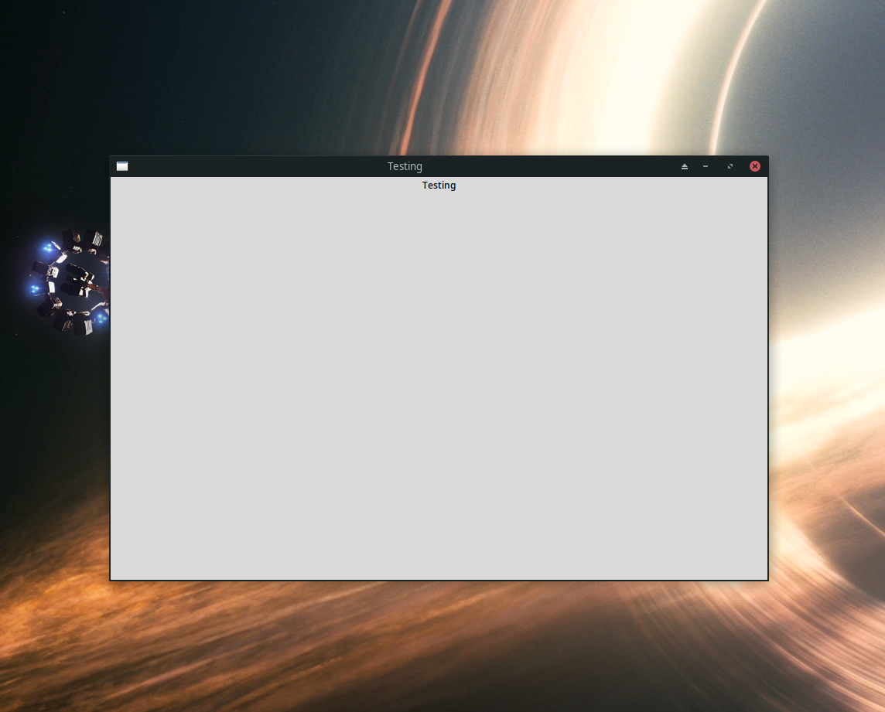
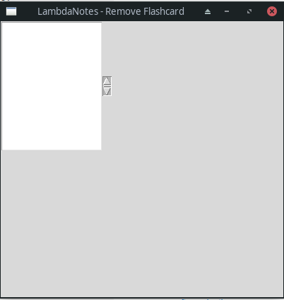
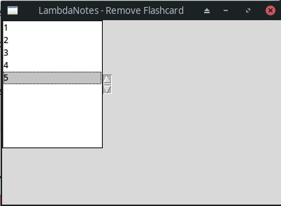
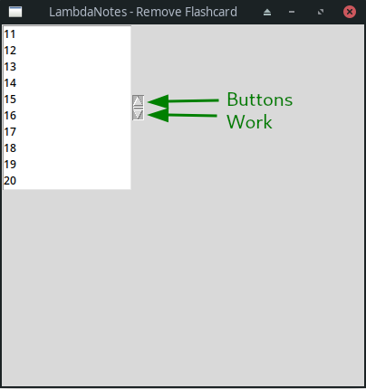

## User Removes Flashcard

I believe this section will be better implemented directly into a GUI. This is because what this feature must do (present a list of flashcards to the user) will be very messy and not dynamic if done in a console implementation. 
I am not focussing on the layout of the UI at this point however, I will edit it later to fit into the designed final UI.
I will use Python's default UI library of Tkinter. The UI code will, as much as possible, be coded in a seperate script which I will call PrelimUI.py. This will be imported into FlashcardFunctions.py. 
I will now return to the Design phase to design a preliminary layout, please see (ADD SECTION ID)

### Setting up PrelimUI.py
To create the UI I will need to import Tkinter, to test this is working I create a test class as so:

```python
#from PrelimUI.py

import tkinter as tk

class TestingWindow(tk.Tk):
    def __init__(self):
        super().__init__()

        self.title("Testing")

        self.label = tk.Label(self, text="Testing")
        self.label.pack()

TestingWindow().mainloop()
```
This results in the following window:


Which can be expanded to:



Clearly the tkinter package is working and I will now layout the front end of the main window.

### MainRemovalWin

I write the following code to start:

```python
class MainRemovalWin(tk.Tk):
    def __init__(self, flashcards):
        super().__init__() #initialises tk class which has been inherited

        #configuration
        self.title('LambdaNotes - Remove Flashcard')
        self.geometry('400x60')

        flashcardList = tk.Listbox(self)
        flashcardList.grid(row=0, column=0)

        flashcardListScroll = tk.Scrollbar(self)
        flashcardListScroll.grid(row=0, column=1)

        flashcardList.config(yscrollcommand = flashcardListScroll.set)
        flashcardListScroll.config(command = flashcardList.yview)
        
        for i in range(0, len(flashcards)):
            flashcardList.insert(flashcards[i])

MainRemovalWin([1, 2, 3, 4, 5]).mainloop()
```

This code was intended to create a window and present the elements in the list that are passed in when it is instantiated ([1, 2, 3, 4, 5]), however it creates the following:



After some research, I came across the reason. The insert function needs to take END as a parameter. Changing the relevant line to the following:

```python
flashcardList.insert(tk.END, flashcards[i])
```

Changes the window to the following:



However the scroll bar still is not seeming to work. I realise at this point that simply adding 5 elements does not test the scroll feature properly; it is possible the scroll bar only appears when there is the opportunity to scroll.

To sort this, I comment out the lines
```python
        for i in range(0, len(flashcards)):
            flashcardList.insert(tk.END, flashcards[i])
```

and replace them with the temporary
```python
        for i in range(0, 1000):
            flashcardList.insert(tk.END, i)
```

Running this once again outputs the window similarly, however with many more elements. I tested the buttons pointed out in the picture below, and they indeed worked, letting me navigate through the list.



Further investigation led me to a page about this topic (Pythontutorial, accessed 19/02/23) which helped me decide to use the ttk feature of Tkinter instead of the base tkinter scrollbars and also edit the grid position declaration of the scrollbar too. The code ends up being the following:

```python
#from PrelimUI.py

class MainRemovalWin(tk.Tk):
    def __init__(self, flashcards):
        super().__init__() #initialises tk class which has been inherited

        #configuration
        self.title('LambdaNotes - Remove Flashcard')
        self.geometry('400x400')

        flashcardList = tk.Listbox(self)
        flashcardList.grid(row=0, column=0)

        flashcardListScroll = ttk.Scrollbar(self, orient='vertical')
        flashcardListScroll.grid(row=0, column=1, sticky=tk.NS)

        flashcardList.config(yscrollcommand = flashcardListScroll.set)
        flashcardListScroll.config(command = flashcardList.yview)
        
#        for i in range(0, len(flashcards)):
 #           flashcardList.insert(tk.END, flashcards[i])
        for i in range(0, 1000):
            flashcardList.insert(tk.END, i)
        
MainRemovalWin([1, 2, 3, 4, 5]).mainloop()
```
