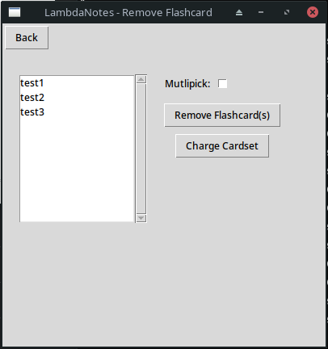
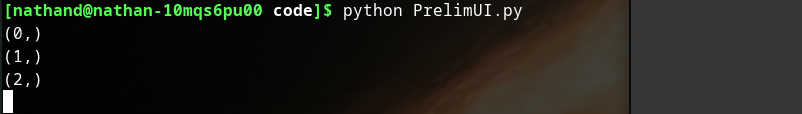
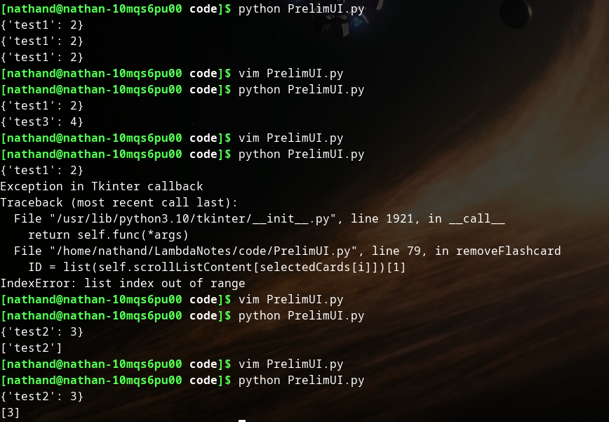
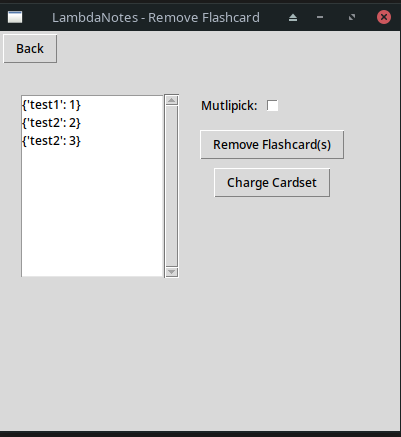
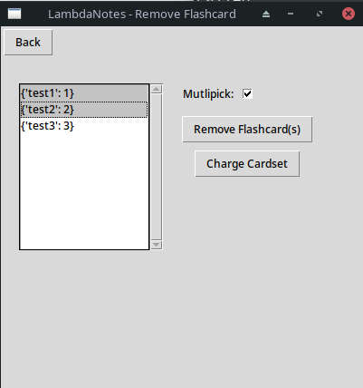
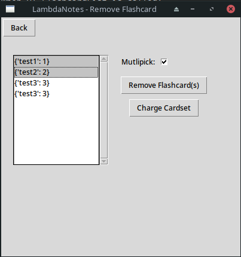

## User Removes Flashcard

I believe this section will be better implemented directly into a GUI. This is because what this feature must do (present a list of flashcards to the user) will be very messy and not dynamic if done in a console implementation. 
I am not focussing on the layout of the UI at this point however, I will edit it later to fit into the designed final UI.
I will use Python's default UI library of Tkinter. The UI code will, as much as possible, be coded in a seperate script which I will call PrelimUI.py. This will be imported into FlashcardFunctions.py. 
I will now return to the Design phase to design a preliminary layout, please see (ADD SECTION ID)

### Setting up PrelimUI.py
To create the UI I will need to import Tkinter, to test this is working I create a test class as so:

```python
#from PrelimUI.py

import tkinter as tk

class TestingWindow(tk.Tk):
    def __init__(self):
        super().__init__()

        self.title("Testing")

        self.label = tk.Label(self, text="Testing")
        self.label.pack()

TestingWindow().mainloop()
```
This results in the following window:


Which can be expanded to:


Clearly the tkinter package is working and I will now layout the front end of the main window.

### MainRemovalWin

I write the following code to start:

```python
class MainRemovalWin(tk.Tk):
    def __init__(self, flashcards):
        super().__init__() #initialises tk class which has been inherited

        #configuration
        self.title('LambdaNotes - Remove Flashcard')
        self.geometry('400x60')

        flashcardList = tk.Listbox(self)
        flashcardList.grid(row=0, column=0)

        flashcardListScroll = tk.Scrollbar(self)
        flashcardListScroll.grid(row=0, column=1)

        flashcardList.config(yscrollcommand = flashcardListScroll.set)
        flashcardListScroll.config(command = flashcardList.yview)
        
        for i in range(0, len(flashcards)):
            flashcardList.insert(flashcards[i])

MainRemovalWin([1, 2, 3, 4, 5]).mainloop()
```

This code was intended to create a window and present the elements in the list that are passed in when it is instantiated ([1, 2, 3, 4, 5]), however it creates the following:


After some research, I came across the reason. The insert function needs to take END as a parameter. Changing the relevant line to the following:

```python
flashcardList.insert(tk.END, flashcards[i])
```

Changes the window to the following:


However the scroll bar still is not seeming to work. I realise at this point that simply adding 5 elements does not test the scroll feature properly; it is possible the scroll bar only appears when there is the opportunity to scroll.

To sort this, I comment out the lines
```python
        for i in range(0, len(flashcards)):
            flashcardList.insert(tk.END, flashcards[i])
```

and replace them with the temporary
```python
        for i in range(0, 1000):
            flashcardList.insert(tk.END, i)
```

Running this once again outputs the window similarly, however with many more elements. I tested the buttons pointed out in the picture below, and they indeed worked, letting me navigate through the list.


Further investigation led me to a page about this topic (Pythontutorial, accessed 19/02/23) which helped me decide to use the ttk feature of Tkinter instead of the base tkinter scrollbars and also edit the grid position declaration of the scrollbar too. The code ends up being the following:

```python
#from PrelimUI.py

class MainRemovalWin(tk.Tk):
    def __init__(self, flashcards):
        super().__init__() #initialises tk class which has been inherited

        #configuration
        self.title('LambdaNotes - Remove Flashcard')
        self.geometry('400x400')

        flashcardList = tk.Listbox(self)
        flashcardList.grid(row=0, column=0)

        flashcardListScroll = ttk.Scrollbar(self, orient='vertical')
        flashcardListScroll.grid(row=0, column=1, sticky=tk.NS)

        flashcardList.config(yscrollcommand = flashcardListScroll.set)
        flashcardListScroll.config(command = flashcardList.yview)
        
#        for i in range(0, len(flashcards)):
 #           flashcardList.insert(tk.END, flashcards[i])
        for i in range(0, 1000):
            flashcardList.insert(tk.END, i)
        
MainRemovalWin([1, 2, 3, 4, 5]).mainloop()
```
Which gives the window the appearance as the following:


Now I have this issue sorted, I start to add and layout the other elements of the UI. The following picture shows a collection of states the visual output took as I periodically ran the code, tested the output (the layout etc) and then returned to the code to update and refactor it.


The final window at this point looks like the following:


With the code for this being:

```python
#from PrelimUI.py

import tkinter as tk
from tkinter import ttk

class TestingWindow(tk.Tk):
    def __init__(self):
        super().__init__()

        self.title("Testing")

        self.label = tk.Label(self, text="Testing")
        self.label.pack()

class MainRemovalWin(tk.Tk):
    def __init__(self, flashcards):
        super().__init__() #initialises tk class which has been inherited
        self.multiPick = False

        #window configuration
        self.title('LambdaNotes - Remove Flashcard')
        self.geometry('400x400')

        #----------------------------------------------------

        #frames
        self.topBarFrame = tk.Frame(self)
        self.rightFrame = tk.Frame(self)
        self.leftFrame = tk.Frame(self)
        self.multiPickFrame = tk.Frame(self.rightFrame)

        self.topBarFrame.grid(row=0, column=0, sticky=tk.NSEW)
        self.rightFrame.grid(row=1, column=1, sticky=tk.NSEW)
        self.leftFrame.grid(row=1, column=0, sticky=tk.NSEW)
        self.multiPickFrame.grid(row=0, column=0, sticky=tk.NSEW)

        #-------------------------------------------------------------------------------------
        
        #elements

        backButton = tk.Button(self.topBarFrame, text="Back", command = self.backButton)
        backButton.grid(row=0, column=0, padx=(2,2), pady=(2,10), sticky=tk.W)

        flashcardList = tk.Listbox(self.leftFrame)
        flashcardList.grid(row=1, column=0, padx=(20,0), pady=20)

        flashcardListScroll = ttk.Scrollbar(self.leftFrame, orient='vertical')
        flashcardListScroll.grid(row=1, column=1,padx=(0,20), pady=20, sticky=tk.NS)

        multiPickLabel = tk.Label(self.multiPickFrame, text="Mutlipick:")
        multiPickLabel.grid(row=0, column=0, pady=(20, 5), sticky=tk.E)

        multiPickCheck = tk.Checkbutton(self.multiPickFrame, variable=self.multiPick)
        multiPickCheck.grid(row=0, column=1, pady=(20, 5), sticky=tk.W)

        removeFlashcardBtn = tk.Button(self.rightFrame, text="Remove Flashcard(s)", command=self.removeFlashcard)
        removeFlashcardBtn.grid(row=2, column=0, pady=(7,0))

        changeCardsetBtn = tk.Button(self.rightFrame, text="Charge Cardset", command=self.changeCardset)
        changeCardsetBtn.grid(row=3, column=0, pady=(7,0))

        #------------------------------------------------------------------------------------------------------------------

#        for i in range(0, len(flashcards)):
 #           flashcardList.insert(tk.END, flashcards[i])
        for i in range(0, 1000):
            flashcardList.insert(tk.END, i)

    def backButton(self):
       pass

    def removeFlashcard(self):
        pass

    def changeCardset(self):
        pass

  

MainRemovalWin([1, 2, 3, 4, 5]).mainloop()
```

### UI backend

#### Listing Flashcards in the Scroll-list

I am creating a file. The original code was written as the following:

```python
#from UIbackend.py

import FlashcardFunctions as Ff
import sqlite3 as sql

#database connection
database = "databases/Flashcards.db"
con = sql.connect(database)
cur = con.cursor()

#subroutines
def FlashcardList(setID):
    li = []
    maxID = Ff.AddFlashcards.CardPointer(setID)
    
    for i in range(0, maxID):
        try:
            res = cur.execute("""
                                SELECT front
                                FROM Flashcards
                                WHERE setID = ? AND
                                WHERE cardID = ?;""", (setID, i))
            flashcard = (cur.fetchall())[0][0]
            li.append(flashcard)

        except sql.Error:
            pass

    return li

print(FlashcardList(1))
```

However this gave multiple errors as can be seen here:


To fix this code I changed the code to instantiate an adder object (as seen previously in TestingEnvironment.py). It is worth noting that the use of this instantiates the AddFlashcard class in FlashcardFunctions.py seems clunky since we are *removing* flashcards. It is something I would like to refactor at a later date, probably moving the CardPointer function to the General class.

The code changes look as such:

```python
#from UIbackend.py

def FlashcardList(setID):
    li = []
    
    adder = Ff.AddFlashcards(database, setID)
    maxID = adder.CardPointer()

    print(maxID)
    
    for i in range(0, maxID+1):
        try:
            res = cur.execute("""
                                SELECT front
                                FROM Flashcards
                                WHERE setID = ? AND
                                WHERE cardID = ?;""", (setID, i))
            flashcard = (cur.fetchall())[0][0]
            li.append(flashcard)

        except sql.Error:
            pass

    return li
```
However this results in the following output:

OUTPUTS ONLY
```
4
[]
```
fake later

I replaced the pass command with a print("Error") which, when the code was run, prints out 5 errors. 

Using the SQLite3 interface, I tested what was wrong with the SQL statement:


And it became clear that it was due to using WHERE twice. Changing this removes the error from before, however a new error occured. 
This was due to the fact that when the value of *i* is a number that refers to a cardID that is not present in the databse. 

Below you can see my workflow (use of print statements to test what is being triggered and when):


And this is the state of the code after this:

```python
#from UIbackend.py

def FlashcardList(setID):
    li = []
    
    adder = Ff.AddFlashcards(database, setID)
    maxID = adder.CardPointer()

    for i in range(0, maxID+1):
        try:
            res = cur.execute("""
                                SELECT front
                                FROM Flashcards
                                WHERE setID = ? AND
                                cardID = ?;""", (setID, i))
            flashcard = res.fetchall()
            
            if len(flashcard) == 0:
                pass
            else:
                li.append(flashcard[0][0])

        except sql.Error:
            print("Error")

    return li
```

I will now import this function to PrelimUI.py, and make use of it to present the user with the flashcards in the scroll list.

The import statement in PrelimUI.py is as follows:
```python
import UIbackend as UI
```

With the iterative statement to add the contents to the scroll-list as follows:
```python
#from PrelimUI.py

        scrollListContent = UI.FlashcardList(1)

        for i in range(0, len(scrollListContent)):
            flashcardList.insert(tk.END, scrollListContent[i])
```

This works as expected and results in the following output:



#### Using Scroll-list:

As discussed in the Design segment, I will route UI requests for SQL-related transactions through the FlashcardFunctions.py file and higher-level functional requests through UIbackend.py as well as some processes natively in the PrelimUI file.

The scroll-list must make use of the its ability to have different types of selection modes to use the multi-select checkbox. This is the functionality I want to add first.

This functionality will reside in the highest level file, PrelimUI.py. I change/add the following relevant lines:

```python

        self.multiPick = tk.IntVar(self)

------------------------------------------------------------ lines cut out

        self.flashcardList = tk.Listbox(self.leftFrame, selectmode=tk.SINGLE)
        self.flashcardList.grid(row=1, column=0, padx=(20,0), pady=20)

------------------------------------------------------------ lines cut out

        self.multiPickCheck = tk.Checkbutton(self.multiPickFrame, variable=self.multiPick, command=self.multiPickCheck)
        self.multiPickCheck.grid(row=0, column=1, pady=(20, 5), sticky=tk.W)

------------------------------------------------------------ lines cut out

    def multiPickCheck(self):    #function determines whether the user has decided to choose multiple flashcards at once and changes the select mode accordingly.
        if self.multiPick.get() == 0:
            self.flashcardList.config(selectmode=tk.SINGLE)
            print(self.multiPick)
        if self.multiPick.get() == 1:
            self.flashcardList.config(selectmode=tk.MULTIPLE)
            print(self.multiPick)
```

#### Removing Flashcards

Now it is time to deal with the set of actions that lead to an SQL transaction to actually remove the flashcards.

In PrelimUI.py I try retrieving the selected options:

```python
#from PrelimUI.py

    def removeFlashcard(self):
        selectedCards = self.flashcardList.curselection()
        print(selectedCards)
```

However when I select a card from the list and click the 'Remove Flashcard' button I get the following output:



This is to be expected at this stage however, at this point, I realised the way UIbackend was passing the flashcard information to PrelimUI would make the deletion of the flashcards chosen very unelegant. 

To sort this I changed the way the flashcard information was passed to PrelimUI from just the front of the card to the front and ID of the card:

```python
#from UIbackend.py

            if len(flashcard) == 0:
                pass
            else:
                flashcard = {flashcard[0][0]:i}
                li.append(flashcard)

```

This does now output to the user the front and the id in a dictionary form, however I will change this at a later date.

As the following screenshot of my workflow shows, it took some trying to isolate the chosen flashcard ID into a useable form, but it worked in the end:



The relevant function in PrelimUI.py is as such:

```python
#from PrelimUI.py

    def removeFlashcard(self):
        selectedCards = self.flashcardList.curselection()
        for i in range(0, len(selectedCards)):
            print(self.scrollListContent[selectedCards[i]])
            ID = list(self.scrollListContent[selectedCards[i]].values())
            print(ID)
```

I will now route this through UIbackend.py to FlashcardFunctions.py. I am doing this layering to future proof the development.

```python
#from FlashcardFunctions.py

class RmFlashcards: #class specifically for functions for removing flashcards.
    
    def __init__(self, database, setID):
        self.con = sql.connect(database)
        self.cur = self.con.cursor()
        self.setID = setID

    def Remove(self, rmList):
        for i in range(0, len(rmList)):
            self.cur.execute(
                """
                DELETE FROM Flashcards
                WHERE setID=? AND cardID=?;
                """, (self.setID, rmList[i])
            )
```

Put into function for repeated updates, and called in __init__:
```python
def updateList(self):   
        self.scrollListContent = UI.FlashcardList(setID)
        for i in range(0, len(self.scrollListContent)):
            self.flashcardList.insert(tk.END, self.scrollListContent[i])
```

I ran the code and tried deleting all the flashcards, but it did not visually show this had happened, however when I rebooted the program it showed it to be empty. I will add three flashcards back in and work to fix this.



You can see above that there are once again three flashcards.

I soon realise that the problem is a disparity between database connections. Although there is a more elegant way to combat this, using context managers and the like, for now I will simply re-start the connection when UI.FlashcardList is called:

```python
def FlashcardList(setID):

    con = sql.connect(database)
    cur = con.cursor()

    li = []
    
    adder = Ff.AddFlashcards(database, setID)
    maxID = adder.CardPointer()

    for i in range(0, maxID+1):
        try:
            res = cur.execute("""
                                SELECT front
                                FROM Flashcards
                                WHERE setID = ? AND
                                cardID = ?;""", (setID, i))
            flashcard = res.fetchall()

            
            if len(flashcard) == 0:
                pass
            else:
                flashcard = {flashcard[0][0]:i}
                li.append(flashcard)

        except sql.Error:
            print("Error")

    return li
```





Fix:

Clear list when function is run:

```python

def updateList(self):   
        self.flashcardList.delete(0, tk.END)
        self.scrollListContent = UI.FlashcardList(setID)
        for i in range(0, len(self.scrollListContent)):
            self.flashcardList.insert(tk.END, self.scrollListContent[i])
```

It now can be fully functionally used to choose and remove flashcards. To see a video of this functioningm, please navigate to the video file RemoveFlashcardList.mp4.


