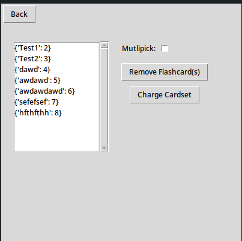
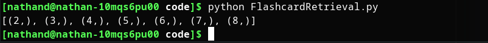
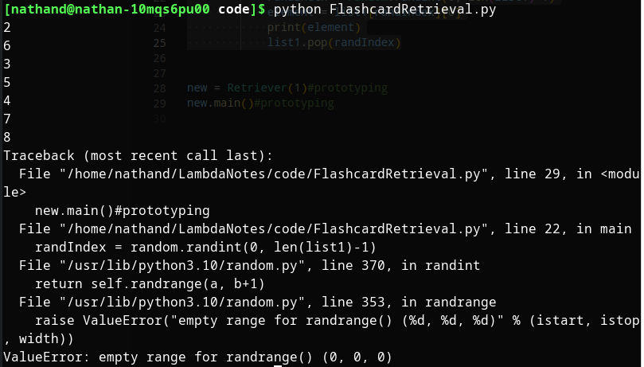
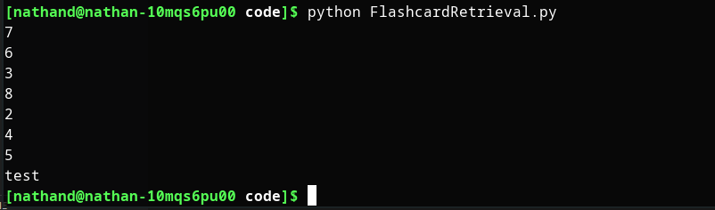
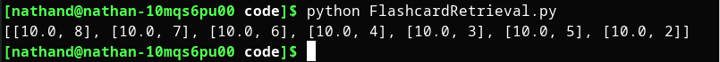
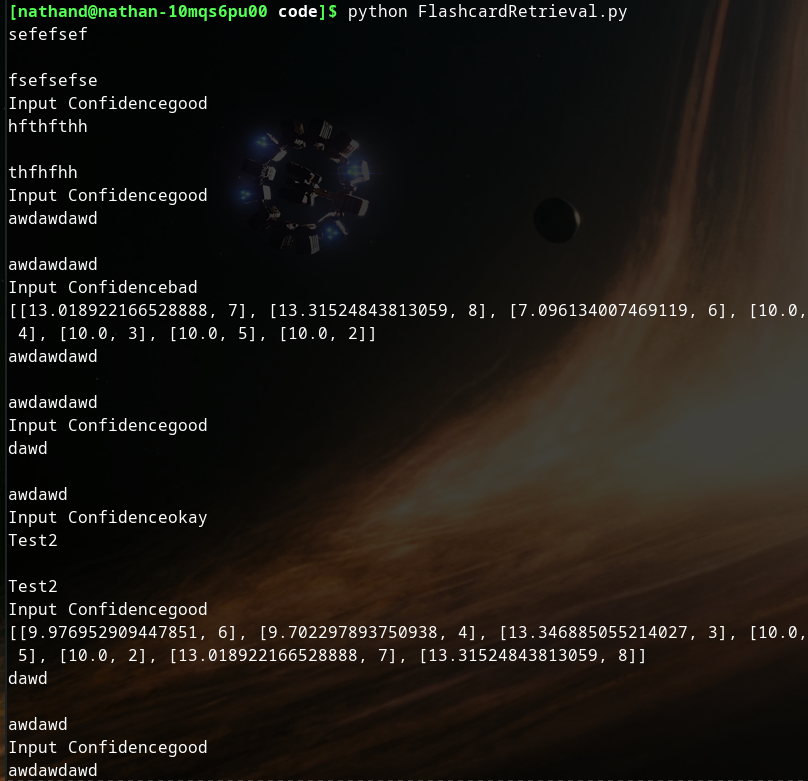
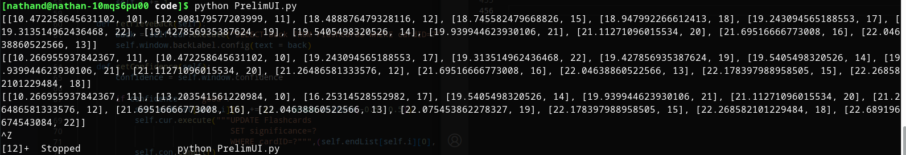
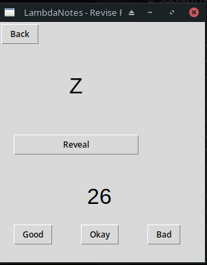

## Flashcard Retrival Ordering Algorithm

The algorithm was heavily designed in the *Design* section, and as discussed I will only be implementing the first version (the random sub-selection version). 

### Iteration 1 - Console Prototype

The initial implementation take the following path:

Note: 

The contents of cardset 1 (Computer Science) for the developmental testing of this module is as shown:



First, I decide the pseudocode described in the *Design* section would work well when packaged in an OO paradigm. Therefore, I create a new file *FlashcardRetrieval.py* and code until this point:

```python
import random
import sqlite3 as sql

database = 'databases/Flashcards.db'

class Retriever:
    
    def __init__(self, setID):
        self.setID = setID
        self.setSize = 20
        self.con = sql.connect(database)
        self.cur = self.con.cursor()
    
    def main(self):
        res = self.cur.execute("""SELECT cardID FROM Flashcards
                                  WHERE setID = ?;""", (self.setID,))
        list1 = list(res.fetchall())
        print(list1)#prototyping

new = Retriever(1)#prototyping
new.main()#prototyping
```

You can see I have added some lines to test how list1 is being formatted. Running the script gives:



We can see this is not in the form we would want it, however we can handle this when the next list (endList) is made by isolating the numbers we want as we use them.

I follow the psuedocode as closely as possible, although slight deviations can be seen in how I use the random method:

```python
def main(self):
        res = self.cur.execute("""SELECT cardID FROM Flashcards
                                  WHERE setID = ?;""", (self.setID,))
        list1 = list(res.fetchall())

        endList = []

        for i in range(0, self.setSize):
            randIndex = random.randint(0, len(list1)-1)
            element = list1[randIndex][0]
            print(element)
            list1.pop(randIndex)
```

Running the above code gives the following error:



This pointed out an oversight that I made in the design phase; if the sub-set size is greater than the number of flashcards in the cardset, the for loop will start iterating over an empty list, causing the error above.

To fix this I add an if statement:

```python
def main(self):
        res = self.cur.execute("""SELECT cardID FROM Flashcards
                                  WHERE setID = ?;""", (self.setID,))
        list1 = list(res.fetchall())

        endList = []

        for i in range(0, self.setSize):
            if len(list1) == 0:
                break
            randIndex = random.randint(0, len(list1)-1)
            element = list1[randIndex][0]
            print(element)
            list1.pop(randIndex)

        print("test")#prototyping
```

Which outputs: 



Adding the code to retrieve the stored card significance and packaging it as designed into endList, gives the following state of main():

```python
def main(self):
        res = self.cur.execute("""SELECT cardID FROM Flashcards
                                  WHERE setID = ?;""", (self.setID,))
        list1 = list(res.fetchall())

        endList = []

        for i in range(0, self.setSize):
            if len(list1) == 0:
                break
            randIndex = random.randint(0, len(list1)-1)
            element = list1[randIndex][0]
            elementSignificance = (self.cur.execute("""SELECT significance FROM Flashcards
                                                     WHERE cardID = ?""", (element,))).fetchall()[0][0]
            endList.append([elementSignificance, element])
            list1.pop(randIndex)

        print(endList)#prototyping
```

Which works, as can be seen by the following testing run:



Continuing to implement the pseudocode into Python, the next major step is to create a console based prototype which will then be implemented into its UI form:

```python
class Retriever:
    
    def __init__(self, setID):
        self.setID = setID
        self.setSize = 20
        self.con = sql.connect(database)
        self.cur = self.con.cursor()
    
    def main(self):
        res = self.cur.execute("""SELECT cardID FROM Flashcards
                                  WHERE setID = ?;""", (self.setID,))
        list1 = list(res.fetchall())

        self.endList = []

        for i in range(0, self.setSize):
            if len(list1) == 0:
                break
            randIndex = random.randint(0, len(list1)-1)
            element = list1[randIndex][0]
            elementSignificance = (self.cur.execute("""SELECT significance FROM Flashcards
                                                     WHERE cardID = ?""", (element,))).fetchall()[0][0]
            self.endList.append([elementSignificance, element])
            list1.pop(randIndex)

    def sort(self, list):
        for Pass in range(0, len(list)-2):
            for i in range(0, len(list)-1-Pass):
                if list[i][0] > list[i+1][0]:
                    temp = list[i]
                    list[i] = list[i+1]
                    list[i+1] = temp
        return list
    
    def retrieve(self):
        self.endList = self.sort(self.endList)

        for i in range(0, 3):
            id = self.endList[i][1]
            front = self.cur.execute("SELECT front FROM Flashcards WHERE cardID=?",(id,)).fetchall()[0][0]
            back = self.cur.execute("SELECT back FROM Flashcards WHERE cardID=?",(id,)).fetchall()[0][0]

            #console prototyping version:
            print(front)
            input('')
            print(back)
            confidence = input('Input Confidence')
            #------------------------------------

            if confidence == 'good':
                self.endList[i][0] += (3 + random.uniform(-0.5, 0.5))
                self.cur.execute("""UPDATE Flashcards
                                    SET significance=?
                                    WHERE cardID=?""",(self.endList[i][0], id))
                self.con.commit()
            if confidence == 'okay':
                self.endList[i][0] += (0 + random.uniform(-0.5, 0.5))
                self.cur.execute("""UPDATE Flashcards
                                    SET significance=?
                                    WHERE cardID=?""",(self.endList[i][0], id))
                self.con.commit()
            if confidence == 'bad':
                self.endList[i][0] += (-3 + random.uniform(-0.5, 0.5))
                self.cur.execute("""UPDATE Flashcards
                                    SET significance=?
                                    WHERE cardID=?""",(self.endList[i][0], id))
                self.con.commit()
        
        print(self.endList)#prototyping
        self.con = sql.connect(database)
        self.cur = self.con.cursor() #reconnect to database to notice previous changes


new = Retriever(1)#prototyping
new.main()#prototyping

while True:
    new.retrieve()
```

Testing this gives the idea that it is working (we can see the significance changing and we are getting different flashcards each cycle):



### Iteration 2 - Attempting PrelimUI Integration

#### Setting Up Window in PrelimUI.py

In much the same way the rest of the UI has been laid out, I create the following:

```python
#from PrelimUI.py
import FlashcardRetrieval as Fr

--------------------------------------- lines cut

class RetrievalWin(tk.Tk):

    def __init__(self, previousWin):
        super().__init__()
        self.previousWin = previousWin

        #window configuration
        self.title = "LambdaNotes - Revise Flashcards"

        #-------------------------------------------------

        #frames
        self.topBarFrame = tk.Frame(self)
        self.topFrame = tk.Frame(self)
    
        self.topBarFrame.grid(row=0, column=0, sticky=tk.W)
        self.topFrame.grid(row=1, column=0, sticky=tk.NSEW)

        #-------------------------------------

        #elements

        backButton = tk.Button(self.topBarFrame, text="Back", command = self.backButton)
        backButton.grid(row=0, column=0, padx=(2,2), pady=(2,10), sticky=tk.W)

        self.frontLabel = tk.Label(self.topFrame, font=('Arial', 24))
        self.frontLabel.grid(row=0, column=0, padx=30, sticky=tk.NSEW)

        self.revealButton = tk.Button(self.topFrame, text="Reveal")
        self.revealButton.grid(row=1, column=0, sticky=tk.NSEW)

    def backButton(self):
        self.destroy()
        (self.previousWin)().mainloop()
```

I'll now add the functions specifically designed through pseudocode in the *Design* section.

```python
def createHalf(self):
        self.bottomHalfFrame = tk.Frame(self)
        self.bottomHalfFrame.grid(row=2, column=0, sticky=tk.NSEW)

        self.backLabel = tk.Label(self.bottomHalfFrame, font=('Arial', 24))
        self.backLabel.grid(row=0, column=1, sticky=tk.NSEW)

        self.goodBtn = tk.Button(self.bottomHalfFrame, text="Good", command=lambda: self.cleanUP('good'))
        self.goodBtn.grid(row=1, column=0, sticky=tk.NSEW)

        self.okayBtn = tk.Button(self.bottomHalfFrame, text="Okay", command=lambda: self.cleanUP('okay'))
        self.okayBtn.grid(row=1, column=1, sticky=tk.NSEW)

        self.badBtn = tk.Button(self.bottomHalfFrame, text="Bad", command=lambda: self.cleanUP('bad'))
        self.badBtn.grid(row=1, column=2, sticky=tk.NSEW)
    
    def cleanUP(self, choice):
        
        self.confidence = choice
        print(self.confidence)
```

At this point, upon thinking how FlashcardRetreival.py and PrelimUI.py will interact, I decide to redesign the FlashcardRetrival *retrieve* function. The new design splits what was *retrieve* into more specialised functions. Please see the *Design* section for the updated pseudocode made before I implemented the following:

### Iteration 3 - Restructuring Code and Intergrating into PrelimUI

As laid out in Iteration 3 of the pseudocode in the *Design* section, the code is restructured to the following:

```python
import random
import sqlite3 as sql

database = 'databases/Flashcards.db'

class Retriever:
    
    def __init__(self, setID, window):
        self.window = window
        self.setID = setID
        self.setSize = 20
        self.con = sql.connect(database)
        self.cur = self.con.cursor()
        self.i = 0
        self.initialSort = False
    
    def main(self):
        res = self.cur.execute("""SELECT cardID FROM Flashcards
                                  WHERE setID = ?;""", (self.setID,))
        list1 = list(res.fetchall())

        self.endList = []

        for i in range(0, self.setSize):
            if len(list1) == 0:
                break
            randIndex = random.randint(0, len(list1)-1)
            element = list1[randIndex][0]
            elementSignificance = (self.cur.execute("""SELECT significance FROM Flashcards
                                                     WHERE cardID = ?""", (element,))).fetchall()[0][0]
            self.endList.append([elementSignificance, element])
            list1.pop(randIndex)

    def sort(self, list):
        for Pass in range(0, len(list)-2):
            for i in range(0, len(list)-1-Pass):
                if list[i][0] > list[i+1][0]:
                    temp = list[i]
                    list[i] = list[i+1]
                    list[i+1] = temp
        return list
    
    def retrieveFront(self):
        if self.initialSort == False:
            self.endList = self.sort()
        if self.i > 2:
            self.endList = self.sort()
            self.i=0
        
        self.id = self.endList[self.i][1]
        front = self.cur.execute("SELECT front FROM Flashcards WHERE cardID=?",(self.id,)).fetchall()[0][0]
        self.window.frontLabel.config(text = front)
        self.i += 1

    def retrieveBack(self):
        back = self.cur.execute("SELECT back FROM Flashcards WHERE cardID=?",(self.id,)).fetchall()[0][0]
        self.window.backLabel.config(text = back)

    def setConfidence(self):
        confidence = self.window.confidence
        
        if confidence == 'good':
            self.endList[self.i][0] += (3 + random.uniform(-0.5, 0.5))
            self.cur.execute("""UPDATE Flashcards
                                SET significance=?
                                WHERE cardID=?""",(self.endList[self.i][0], self.id))
            self.con.commit()
        if confidence == 'okay':
            self.endList[self.i][0] += (0 + random.uniform(-0.5, 0.5))
            self.cur.execute("""UPDATE Flashcards
                                SET significance=?
                                WHERE cardID=?""",(self.endList[self.i][0], self.id))
            self.con.commit()
        if confidence == 'bad':
            self.endList[self.i][0] += (-3 + random.uniform(-0.5, 0.5))
            self.cur.execute("""UPDATE Flashcards
                                SET significance=?
                                WHERE cardID=?""",(self.endList[self.i][0], self.id))
            self.con.commit()
        
        print(self.endList)#prototyping
        self.con = sql.connect(database)
        self.cur = self.con.cursor() #reconnect to database to notice previous changes
```

In PrelimUI.py, I make use of this modulated functionality:

```python
class RetrievalWin(tk.Tk):

    def __init__(self, previousWin):
        super().__init__()
        self.previousWin = previousWin

        self.confidence = tk.StringVar()

        #window configuration
        self.title("LambdaNotes - Revise Flashcards")

        #-------------------------------------------------

        #frames
        self.topBarFrame = tk.Frame(self)
        self.topFrame = tk.Frame(self)
    
        self.topBarFrame.grid(row=0, column=0, sticky=tk.W)
        self.topFrame.grid(row=1, column=0, sticky=tk.NSEW)

        #-------------------------------------

        #elements

        backButton = tk.Button(self.topBarFrame, text="Back", command = lambda: self.backButton())
        backButton.grid(row=0, column=0, padx=(2,2), pady=(2,10), sticky=tk.W)

        self.frontLabel = tk.Label(self.topFrame, font=('Arial', 24))
        self.frontLabel.grid(row=0, column=0, padx=30, sticky=tk.NSEW)

        self.revealButton = tk.Button(self.topFrame, text="Reveal", command=lambda: self.reveal())
        self.revealButton.grid(row=1, column=0, sticky=tk.NSEW)

        self.retriever = Fr.Retriever(track.setID, self)
        self.retriever.main()
       
        self.retriever.retrieveFront()

    def backButton(self):
        self.destroy()
        (self.previousWin)().mainloop()
    
    def reveal(self):
        self.createHalf()
        self.retriever.retrieveBack()

    def createHalf(self):
        self.bottomHalfFrame = tk.Frame(self)
        self.bottomHalfFrame.grid(row=2, column=0, sticky=tk.NSEW)

        self.backLabel = tk.Label(self.bottomHalfFrame, font=('Arial', 24))
        self.backLabel.grid(row=0, column=1, sticky=tk.NSEW)

        self.goodBtn = tk.Button(self.bottomHalfFrame, text="Good", command=lambda: self.cleanUP('good'))
        self.goodBtn.grid(row=1, column=0, sticky=tk.NSEW)

        self.okayBtn = tk.Button(self.bottomHalfFrame, text="Okay", command=lambda: self.cleanUP('okay'))
        self.okayBtn.grid(row=1, column=1, sticky=tk.NSEW)

        self.badBtn = tk.Button(self.bottomHalfFrame, text="Bad", command=lambda: self.cleanUP('bad'))
        self.badBtn.grid(row=1, column=2, sticky=tk.NSEW)
    
    def cleanUP(self, choice):
        
        self.confidence = choice
        self.retriever.setConfidence()
        
        self.bottomHalfFrame.destroy()
        self.retriever.retrieveFront()
```

To test this, I remove all flashcards from the set, and create a set of 13 flascards, where the front is a letter of the alphabet, and the back in the next letter. e.g. front = a, back = b.

The aim is to drop the significance of card (A, B) down as far as possible, so we can see if it the one suggested every 3 cards.

This works for a while, but then suddenly the card stops appearing at all. Checking its significance in the SQLite3 interface doesn't show any glaring errors. 

However, adding a print statement in FlashcardRetrieval.py to show the state of EndList after each time it is sorted shows the significance of flashcard with ID 10, (the card with front=A, back=B) increasing even when I am trying to decrease it:



The only explanation I can think of is that the significance is being stored as a magnitude in the database and, after several reductions in significance, when the significance becomes negative, the database stores its magnitude, ignoring its sign, and so more negation makes its magnitude higher. 

To attempt to sort this I chance the setConfidence method:

```python
def setConfidence(self):
        confidence = self.window.confidence
        print(confidence)

        randomAddition = random.uniform(-0.5, 0.5)
        print("If good: ", str(3+randomAddition))
        print("If okay: ", str(0+randomAddition))
        print("If bad: ", str(-3+randomAddition))
        
        if confidence == 'good':
            if (self.endList[self.i][0] + (3+ randomAddition) )< 0:
                self.endList[self.i][0] = 0
            else:
                self.endList[self.i][0] += (3 + randomAddition)
            self.cur.execute("""UPDATE Flashcards
                                SET significance=?
                                WHERE cardID=?""",(self.endList[self.i][0], self.id))
            self.con.commit()

        if confidence == 'okay':
            if (self.endList[self.i][0] + randomAddition) < 0:
                self.endList[self.i][0] = 0
            else:
                self.endList[self.i][0] += (0 + randomAddition)
            self.cur.execute("""UPDATE Flashcards
                                SET significance=?
                                WHERE cardID=?""",(self.endList[self.i][0], self.id))
            self.con.commit()

        if confidence == 'bad':
            if (self.endList[self.i][0] + (-3 + randomAddition)) < 0:
                self.endList[self.i][0] = 0
            else:
                self.endList[self.i][0] += (-3 + randomAddition)
            self.cur.execute("""UPDATE Flashcards
                                SET significance=?
                                WHERE cardID=?""",(self.endList[self.i][0], self.id))
            self.con.commit()

        #print(self.endList)#prototyping
        self.con = sql.connect(database)
        self.cur = self.con.cursor() #reconnect to database to notice previous changes
```
This fix makes the code much more robust.

However the results still seem off; the wrong elements are changing their significance. When I put in a multitude of print statements to see what is happening, I realise that the cards that are being shown on screen are not the ones whose signidficance is changing. 

After scouring the code, I realise I made a simple logic error. See the code snippet:

```python
def retrieveFront(self):
    if self.initialSort == False:
        self.endList = self.sort(self.endList)
        self.initialSort = True
    if self.i > 2:
        self.endList = self.sort(self.endList) 
        self.i=0
    
    self.id = self.endList[self.i][1]
    print(self.id)
    front = self.cur.execute("SELECT front FROM Flashcards WHERE cardID=?",(self.id,)).fetchall()[0][0]
    self.window.frontLabel.config(text = front)
    self.i += 1 #ERROR IS ON THIS LINE
```
You can see I am incrementing self.i **after** I define self.id. With the way PrelimUI.py works, it is basically changing the variable midprocess which leads to the disparities I was seeing. To fix this, I simply move its position:

```python
def retrieveFront(self):
    self.i += 1

    if self.initialSort == False:
        self.endList = self.sort(self.endList)
        self.initialSort = True
    if self.i > 2:
        self.endList = self.sort(self.endList) 
        self.i=0
    
    self.id = self.endList[self.i][1]
    print(self.id)
    front = self.cur.execute("SELECT front FROM Flashcards WHERE cardID=?",(self.id,)).fetchall()[0][0]
    self.window.frontLabel.config(text = front)
    
```

The two fixes I made help the code become a fully working version. 

See the video RevisionTest1.mp4 for evidence. 

### Tidying Up

I will now make visual changes to the UI to make it look nicer. The current final iteration is as follows:

```python
class RetrievalWin(tk.Tk):

    def __init__(self, previousWin):
        super().__init__()
        self.previousWin = previousWin

        self.confidence = tk.StringVar()

        #window configuration
        self.title("LambdaNotes - Revise Flashcards")
        self.geometry("300x350")

        #-------------------------------------------------

        #frames
        self.topBarFrame = tk.Frame(self)
        self.topFrame = tk.Frame(self)
    
        self.topBarFrame.grid(row=0, column=0, sticky=tk.W)
        self.topFrame.grid(row=1, column=0, sticky=tk.NSEW)

        #-------------------------------------

        #elements

        backButton = tk.Button(self.topBarFrame, text="Back", command = lambda: self.backButton())
        backButton.grid(row=0, column=0, padx=(2,2), pady=(2,10), sticky=tk.W)

        self.frontLabel = tk.Label(self.topFrame, font=('Arial', 24))
        self.frontLabel.grid(row=0, column=1, padx=100, pady=30, sticky=tk.NSEW)

        self.revealButton = tk.Button(self.topFrame, text="Reveal", command=lambda: self.reveal())
        self.revealButton.grid(row=1, column=1, padx=20, pady=20, sticky=tk.NSEW)

        self.retriever = Fr.Retriever(track.setID, self)
        self.retriever.main()
       
        self.retriever.retrieveFront()

    def backButton(self):
        self.destroy()
        (self.previousWin)().mainloop()
    
    def reveal(self):
        self.createHalf()
        self.retriever.retrieveBack()

    def createHalf(self):
        self.bottomHalfFrame = tk.Frame(self)
        self.bottomHalfFrame.grid(row=2, column=0, sticky=tk.NSEW)

        self.backLabel = tk.Label(self.bottomHalfFrame, font=('Arial', 24))
        self.backLabel.grid(row=0, column=1, pady=20, sticky=tk.NSEW)

        self.goodBtn = tk.Button(self.bottomHalfFrame, text="Good", command=lambda: self.cleanUP('good'))
        self.goodBtn.grid(row=1, column=0, padx=20, sticky=tk.NSEW)

        self.okayBtn = tk.Button(self.bottomHalfFrame, text="Okay", command=lambda: self.cleanUP('okay'))
        self.okayBtn.grid(row=1, column=1, padx=20, sticky=tk.NSEW)

        self.badBtn = tk.Button(self.bottomHalfFrame, text="Bad", command=lambda: self.cleanUP('bad'))
        self.badBtn.grid(row=1, column=2, padx=20, sticky=tk.NSEW)
    
    def cleanUP(self, choice):
        
        self.confidence = choice
        self.retriever.setConfidence()
        
        self.bottomHalfFrame.destroy()
        self.retriever.retrieveFront()
```

And looks like:




I will now integrate a pathway to this function from the menu:

