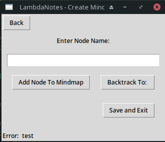
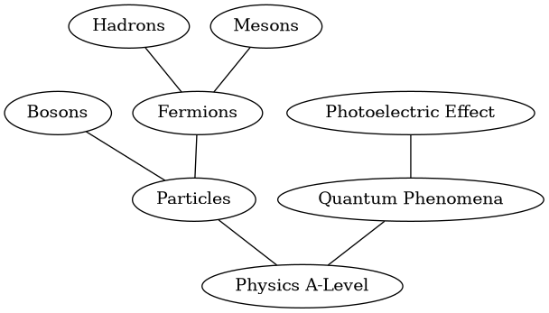
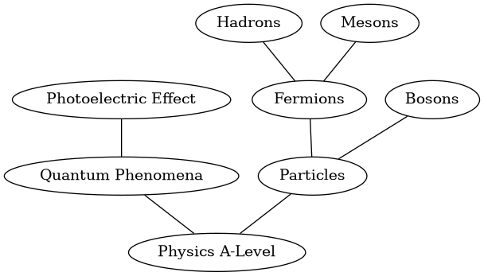
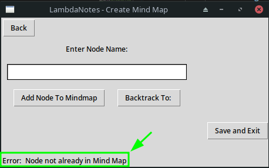
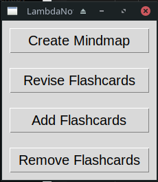

# Mind Maps

As has been discussed, the full regime of planned mind map functionality in the Program Requirements will not be implemented in this project, however the project outcome will still have the core mind map feature. 

## Mind Map Creation Window

I write the following code to try and create a tkinter UI that matches the designed UI as closely as possible:

```python
class MindmapCreationWin(tk.Tk):

    def __init__(self, previousWin):
        super().__init__()

        self.previousWin = previousWin
        self.nodeName = tk.StringVar()
        #window configuration

        self.title("LambdaNotes - Create Mind Map")

        #-------------------------------------------------

        #frames

        self.topBarFrame = tk.Frame(self)
        self.mainFrame = tk.Frame(self)
        self.bottomFrame = tk.Frame(self)
        
        self.buttonFrame = tk.Frame(self.mainFrame)
        self.saveExitFrame = tk.Frame(self.bottomFrame)
        self.errorLabelFrame = tk.Frame(self.bottomFrame)

        self.topBarFrame.grid(row=0, column=0, sticky=tk.NSEW)
        self.mainFrame.grid(row=1, column=0, sticky=tk.NSEW)
        self.bottomFrame.grid(row=2, column=0, sticky=tk.NSEW)

        self.buttonFrame.grid(row=2, column=0)
        self.saveExitFrame.grid(row=0, column=2, sticky=tk.E)
        self.errorLabelFrame.grid(row=1, column=0, sticky=tk.W)

        #-------------------------------------------------------------------

        #elements

        backButton = tk.Button(self.topBarFrame, text="Back", command = lambda: self.backButton())
        backButton.grid(row=0, column=0, padx=(2,2), pady=(2,10), sticky=tk.W)

        nodeAddLabel = tk.Label(self.mainFrame, text="Enter Node Name:")
        nodeAddLabel.grid(row = 0, column =0, sticky=tk.NSEW)

        self.nodeNameEntry = tk.Entry(self.mainFrame, width=30, textvariable=self.nodeName, font=('Arial', 14))
        self.nodeNameEntry.grid(row=1, column=0, padx=10, pady=15, sticky=tk.NSEW)

        addNodeBtn = tk.Button(self.buttonFrame, text="Add Node To Mindmap", command=lambda: self.addNode)
        addNodeBtn.grid(row=0, column=0, padx=10, sticky=tk.NSEW)

        backtrackBtn = tk.Button(self.buttonFrame, text="Backtrack To: ", command=lambda: self.backtrack)
        backtrackBtn.grid(row=0, column=1, padx=10, sticky=tk.NSEW)

        saveExitBtn = tk.Button(self.saveExitFrame, text="Save and Exit", command=lambda: self.saveExit)
        saveExitBtn.grid(row=0, column=0, padx=(135, 0), pady=25, sticky=tk.E)

        errorNotificationLabel = tk.Label(self.errorLabelFrame, text="Error: ")
        errorNotificationLabel.grid(row=0, column=0)

        errorLabel = tk.Label(self.errorLabelFrame, text="test")
        errorLabel.grid(row=0, column=1)

    def backButton(self):
        self.destroy()
        (self.previousWin)().mainloop()

    def addNode(self):
        pass

    def backtrack(self):
        pass

    def saveExit(self):
        pass

```

Which results in the visual output:



I am happy with this being the final iteration of the UI for the PrelimUI version of LambdaNotes.

## Mind Map Creation Code - Iteration 2

As was discussed in the *Design* section, I am taking the proof-of-concept prototype of the mind map creation code to be the first iteration, which is known to work as expected. I then redesigned it using pseudocodem and I will now implement the changes into code. 

The file name I will be using is MindMapCreation.py

```python
#from MindMapCreation.py

import pydot as pd #imports package needed for mindmap output


#Class Node is the class that will be a blueprint for every 'node' of data on the mind map. 
class Node: 
    def __init__(self, name):
        self._name = name 
        self.connections = [] #this is where the connected nodes to each instance will be stored.

    def name(self): #makes it easier to access the name of each object.
        return self._name 

    def connector(self, previousNode): 
        self.connections.append(previousNode) #adds the previous node (hence the node the instance which is using this function was connected onto) to the connections list
       

#Class MindMap is a class that will handle the initialisation of a new mindmap and contructs it once all the nodes have been added. Not much use for now since we are only creating one mindmap but will be helpful when we move to full development.
class MindMap:
    def __init__(self, nodes, names, graph):
        self._nodes = nodes
        self._names = names
        self._graph = graph

    def edges(self):
        for i in range(0, len(self._names)): #iterates through the length of the list of node names (not happy with doing it this way)
            parent = self._nodes[self._names[i]].name() #sets the parent of the connection to the node with the name at the index i. Hence all nodes will be iterated over in this way.
            for j in range(0, len(self._nodes[self._names[i]].connections)): #iterates over the list of connections to the parent node
                edge = pd.Edge(parent, self._nodes[self._names[i]].connections[j]) #creates edge between parent and current node (at index j in the nodes connection list)
                self._graph.add_edge(edge) #adds edge to graph
        return self._graph
    
class Maker:
    def __init__(self):
        self.graph = pd.Dot(graph_type="graph", rankdir="UD")
        self.nodes = {}
        self.names = []
        self.count = 0
        self.lastNode = 0
        self.firstNode = True

    def input(self, backtrack, instance):
    
        if self.lastNode != 0: 
            currentIndex = self.names.index(self.lastNode)
        
        nextInput = instance.nodeName.get()
        print(self.nodes)
        
        if backtrack == True: #function to be able to backtrack, (need to fix, e.g. "jk<l" would cause error)
            if nextInput in self.nodes:
                self.lastNode = nextInput #takes input after the '<' as the node the user wants to backtrack to.
            else:
                instance.errorLabel.config(text="Node not already in Mind Map") 
        
        
        else: #if input is not a special case, node addition can go ahead:

            if nextInput not in self.nodes:
                self.nodes[nextInput] = Node(nextInput)
                self.names.append(nextInput)

            if self.firstNode != True: #needed since first node cannot connect to nothing!
                self.nodes[nextInput].connector(self.lastNode)
                self.lastNode = self.nodes[nextInput].name()
            else: #hence if it is first node then it has no connections.
                self.firstNode = False
                self.lastNode = nextInput

    def create(self):
        self.map = MindMap(self.nodes, self.names, self.graph)
        self.graph = self.map.edges()

    def output(self):
        self.graph.write_png("/tmp/test.png")

```
I then imported this file (as MmC) into PrelimUI and made the relevant changes:

```python
#from PrelimUI.py

        #__init__ function
        self.maker = MmC.Maker()

    def backButton(self):
        self.destroy()
        (self.previousWin)().mainloop()

    def addNode(self):
        self.maker.input(False, self)
        self.nodeNameEntry.delete(0, tk.END)

    def backtrack(self):
        self.maker.input(True, self)
        self.nodeNameEntry.delete(0, tk.END)

    def saveExit(self):
        self.maker.create()
        self.maker.output()
        self.backButton()
```

To test this is working as expected I will try to use the tool to recreate the same mind map as was created by the proof-of-concept prototype. To remind the reader, this is what it looked like:



To see me conducting this test, please see MindMapCreationTest1.mp4

The resultant mind map is as shown:



Although it is a mirror image, it successfully represents the same information in an almost identical way. Because of this, I am happy the mind map creation is working.

Next, I want to test how it handles trying to backtrack to a non-existing node:

- I add 'root' as the first node
- I connect to that 'test'
- I type in 'roit' (simulating a spelling error) and click the backtrack button.

The error updates as shown:



This works, however after succesfully adding another node, the error does not dissappear, to change this I add a new checker variable into the input function of the Maker class in MindMapCreation.py:

```python
#from MindMapCreation.py

def __init__(self):
        self.graph = pd.Dot(graph_type="graph", rankdir="UD")
        self.nodes = {}
        self.names = []
        self.count = 0
        self.lastNode = 0
        self.firstNode = True
        self.errorChecker = False

def input(self, backtrack, instance):

    if self.lastNode != 0: 
        currentIndex = self.names.index(self.lastNode)
    
    nextInput = instance.nodeName.get()
    
    if backtrack == True: #function to be able to backtrack, (need to fix, e.g. "jk<l" would cause error)
        if nextInput in self.nodes:
            self.lastNode = nextInput #takes input after the '<' as the node the user wants to backtrack to.
            if self.errorChecker == True:
                instance.errorLabel.config(text="") #resets error messge
        else:
            instance.errorLabel.config(text="Node not already in Mind Map") 
            self.errorChecker = True
    
    else: #if input is not a special case, node addition can go ahead:
        if self.errorChecker == True:
                instance.errorLabel.config(text="")
```

Doing the following test:
- add 'root' as node
- add 'test' as node
- backtrack to 'roit' (error shown)
- add 'test2' as node

Now clears the error once test2 is added. This is now working succesfully.

## Adding To PrelimUI Menu

I add a button and function to the Menu class in PrelimUI.py in the same fashion I have previously:

```python
#from PrelimUI.py

class Menu(tk.Tk):
    
    def __init__(self):
        super().__init__()

        #window configuration
        self.title('LambdaNotes - Main Menu')

        #-------------------------------------------

        #elements
        CreateMindmapBtn = tk.Button(self, text="Create Mindmap", command=self.CreateMindmap, font=('Arial', 15))
        CreateMindmapBtn.grid(row=0, column=0, padx=10, pady=10, sticky=tk.NSEW)
        
        ReviseFlashcardBtn = tk.Button(self, text="Revise Flashcards", command=self.ReviseFlashcard, font=('Arial', 15))
        ReviseFlashcardBtn.grid(row=1, column=0, padx=10, pady=10, sticky=tk.NSEW)

        AddFlashcardBtn = tk.Button(self, text="Add Flashcards", command=self.AddFlashcard, font=('Arial', 15))
        AddFlashcardBtn.grid(row=2, column=0, padx=10, pady=10, sticky=tk.NSEW)

        RmFlashcardBtn = tk.Button(self, text="Remove Flashcards", command=self.RmFlashcard, font=('Arial', 15))
        RmFlashcardBtn.grid(row=3, column=0, padx=10, pady=10, sticky=tk.NSEW)
    
    def CreateMindmap(self):
        self.destroy()
        MindmapCreationWin(Menu).mainloop()
    
    def ReviseFlashcard(self):
        self.destroy()
        ChangeCardset(RetrievalWin).mainloop()
    
    def AddFlashcard(self):
        self.destroy()
        AddFlashcard(Menu).mainloop()
    
    def RmFlashcard(self):
        self.destroy()
        MainRemovalWin(Menu).mainloop()
```

Which gives the following successful output:



Where all buttons work.
